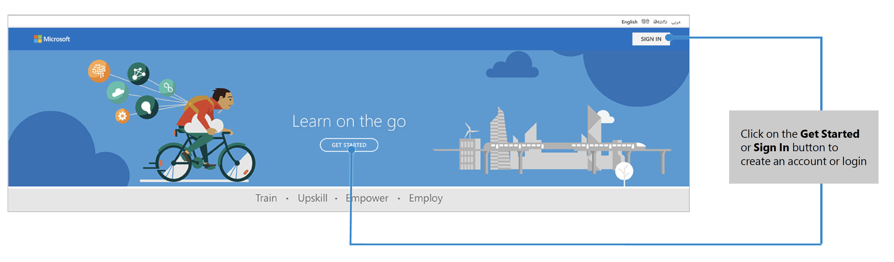
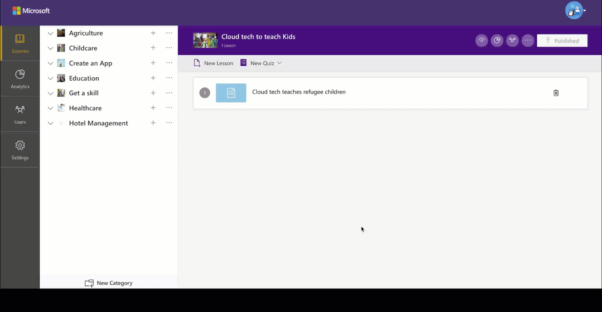

Microsoft Community Training platform provides various tools and functionalities to help you easily create, manage and monitor all the learning activities for the training program. 

To make it simple for new users to get started with Microsoft Community Training platform, we have created a brief step by step implementation guide on how to configure the learning platform, upload content, onboard users, select learner endpoints, track progress and measure learning outcome using the management portal.  
 
## Step 1 – Login to the portal
 
Click **Get Started** or **Sign In** button to create an account or login. You can Login with your mobile number, social account (aka email address) or Azure Active Directory account as defined at the [**time of deploying the platform**](https://docs.microsoftcommunitytraining.com/v1/docs/installation-guide-detailed-steps) from Azure marketplace.  

When logging in for the first time, you will be asked to complete your profile information and finished the sign-in process. The profile information users have to fill at the time of sign up can be customized from the management portal. 

 
## Step 2 – Switch to administrator view of the portal

Once you login to the portal, by default, you will be shown the learner view. Click the **round user icon** on the top right of the screen and choose the **View as an administrator** option from the drop-down menu to open the management portal.  

{height="" width="300"}

The management portal provides all the administrative functions like course management, user management, tracking and monitoring the training with analytics, portal settings, etc. as highlight below. It is designed on [**role-based access**](https://docs.microsoftcommunitytraining.com/docs/user-role-and-management-portal-overview) and functionalities are available to the users as per granted management permissions.

@(Warning)(Best Practices)(After logging into the management portal, it is recommended to [**add administrators**](https://docs.microsoftcommunitytraining.com/docs/add-an-administrtor-to-the-portal) and delegate portal management and configuration to other users in the organization.)

## Step 3 - Customize the training portal

You can personalize the training portal by configuring various elements of the interface and user settings. To do so, access the **Settings** tab on the management portal. 

* You can customize the [**look and feel of the portal**](https://docs.microsoftcommunitytraining.com/docs/configure-the-look-and-feel-of-your-portal)  to reflect organization’s branding such as portal name, logos, color themes, banners and messaging.

*  You can also [**create additional profile fields**](https://docs.microsoftcommunitytraining.com/docs/add-additional-profile-fields-for-user-information) to capture user information at the time sign up.

*  Lastly, you can [**restrict portal access**](https://docs.microsoftcommunitytraining.com/docs/restrict-portal-access-to-users-outside-your-organization) to  unauthorized users and protect your training content

## Step 4 – Upload training content to the portal  
 
Microsoft Community Training platform  is optimized for learning with videos on the mobile devices – even on low-bandwidth or while offline. It provides an easy way for organizations to create and manage online courses to provide seamless learning experience.   
 
All the courses in the platform are created under a category. These categories can be based on topics, profession, skill, etc. Each course on the portal will have one or more lessons, practice quizzes, exams, certification etc. 

{height="250" width="400"}

To add learning material into your training portal, first you need to [**define a category**](https://docs.microsoftcommunitytraining.com/docs/create-a-course-category)  and [**create courses under the category**](https://microsoftindia.document360.io/docs/create-a-course-category). This can be done from the **Content Tab** in the management portal. When you create a new course, remember the following: 

1. The course name should simple and clear. Users should instantly understand the topic of the course upon reading the title. 

2. Write a description so your users will have a clear idea of what they will learn in each course 

3. Upload a customized image relating to the course topic to provide visual cue to the learners. Try to create different thumbnails for each course, as to avoid redundancy by using the same image. 

 Once you have created the courses, [**add learning materials**](https://docs.microsoftcommunitytraining.com/docs/upload-content-to-a-course) like Video, PDFs, PowerPoint, YouTube Links, etc. and [**manage the course options**](https://microsoftindia.document360.io/docs/manage-user-enrollment-for-a-course-1) according to your needs. Lastly, [**add practice quiz and exams**](https://microsoftindia.document360.io/docs/create-practice-course-and-exam) before [**publishing the course**](https://microsoftindia.document360.io/docs/publishing-course) for the learners. 
 
 
 
@(Warning)(Tips)(Use [**bulk upload course**](https://microsoftindia.document360.io/docs/create-a-new-course#option-2--create-multiple-courses-in-a-category) to quickly upload your training content on the portal)

## Step 5 – Create group and onboard learners to the portal  
 
Go to the **Users** tab in the management portal to start onboarding learners to the platform. To quickly add learners to the platform, create a CSV file containing the user’s data and [**bulk upload users**](https://microsoftindia.document360.io/docs/create-a-new-group-1#add-multiple-users-to-a-group) to the portal. By adding users in bulk, the process is simplified.  
 
In case you have to onboard and manage a large user base, [**create groups**](https://microsoftindia.document360.io/docs/create-a-new-group-1) to organize your users based on job profile, location, designation, etc. and [**add users**](https://microsoftindia.document360.io/docs/create-a-new-group-1#add-users-manually-to-group) manually into these groups. Once you have added users to the group, you can [**assign courses**](https://microsoftindia.document360.io/docs/assign-course-to-group-users-1). 
 

 
Here are some best practices to follow to ease user management on the portal: 

1. [**Assign administrators**](https://docs.microsoftcommunitytraining.com/docs/add-an-administrtor-to-the-portal#add-a-group-administrator-to-the-portal) to delegate administrative tasks like user onboarding and course enrollment to the ground level facilitator or supervisors. Facilitators/Supervisors can track and monitor course activities of all the learners in their group and [**send reminders**](https://docs.microsoftcommunitytraining.com/docs/send-announcement-to-the-users) to drive completion.  

2. Leverage user profile information to [**create rules and automatically add users**](https://docs.microsoftcommunitytraining.com/docs/setup-automatic-user-enrollment-for-a-group-1) to different groups at the time of sign up and assign courses  

To learn more about how to manage users on the Microsoft Community Training management portal, please refer to the [**User Management**](https://docs.microsoftcommunitytraining.com/docs/user-management-overview-1) section of our product documentation. 

## Step 6 – Launch and publicize the portal  
 
Once you are done with customizing, uploading content and adding users to the portal, you are almost ready to launch the portal for the target audience and start publicizing.  
 
Here are some checklists for you to complete before you proceed with the rollout: 

1. [**Customize the certificate template**](https://docs.microsoftcommunitytraining.com/docs/customize-the-certificate-template) awarded to the learners on the course completion  

2. [**Create and publish the mobile app**](https://docs.microsoftcommunitytraining.com/v1/docs/create-mobile-app-for-your-training-portal) for the learning portal on the Google Play Store  

3. For delivering learning inside Microsoft Teams, [**create a Teams app**](https://docs.microsoftcommunitytraining.com/docs/create-teams-app-for-your-training-portal) and pin as Training tab in Microsoft Teams via Office 365 admin portal.

4. Train the supervisors/facilitators (aka group administrators) on different aspect of the management portal and their roles and responsibilities.

5. Do a soft launch with limited number of users to make sure the web app and mobile app are working as expected. 

Once the platform is rolled out to the target audience, you can start publicizing the portal with your target learners in the following manners: 

1. Create and display posters with QR code in the office area or near the lifts  

2. Broadcasting information via emailers or social media network (for e.g. WhatsApp messages) with a link to the app 

3. Contests, prizes, performance related incentives create excitement and anticipation 

4. A letter from the management on the day of the launch encouraging learners to begin 

 The list mentioned above is just indicative. You can use any other method as deemed fit for your audience.
 
##  Step 7 – Track learner’s engagement and course completion  
 
Once the portal has been rolled out to the learners and they have started consuming the course content, you can  use the inbuilt analytics available in the management portal to track course enrollment/completion and monitor all learner activities on the portal.  
 
To view these analytics, go to the **Analytics** tab in the management view of the portal. In this section, you will [**find reports**](../analytics/2_analytics-overview) providing information on course enrollment across categories and courses, learners performance, content quality and much more. You can also create custom reports to analyze specific information using Power BI. 
 

These reports are important for tracking online learning and helps administrators to iterate and make improvements to the learning program. 
