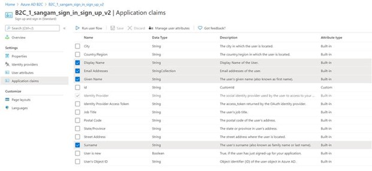

# Configure login identity for the platform

Microsoft Community Training platform provides three types of login:
1. Phone number
2. Social email-based login via your Microsoft, Google or Facebook account
3. Microsoft Work or School account

@(Info)(Note)(Please note this article is in continuation of the [**installation article**](../../infrastructure-management/install-your-platform-instance/3_installation-guide-detailed-steps).)

In this article, we will walk you through on how to configure login identity for the platform.
 
##  Phone based authentication

There is no additional configuration needed for phone-based login.
 
##  Social account or email based authentication

### 1. Configure your Social Account
You can configure social account for your training portal by following the instructions below:  

#### Step 1 - Setup your Azure AD B2C
You can create a new Azure AD B2C tenant or create an existing one based on your organization requirement.

1.	Login to [**Azure portal**](https://portal.azure.com/).

2.	Create a new [**Azure Active Directory B2C**](https://docs.microsoft.com/en-us/azure/active-directory-b2c/tutorial-create-tenant)  tenant.

3.	Link the Azure Active Directory B2C tenant just created to your Azure subscription.  

#### Step 2 - Configure your Identity provider
Here are the steps to create policies based on the Identity Provider: 

1.	Configure the identity provider – based on your chosen provider such as [**Microsoft**](https://docs.microsoft.com/en-us/azure/active-directory-b2c/active-directory-b2c-setup-msa-app), [**Google**](https://docs.microsoft.com/en-us/azure/active-directory-b2c/active-directory-b2c-setup-goog-app) and [**Facebook**](https://docs.microsoft.com/en-us/azure/active-directory-b2c/active-directory-b2c-setup-fb-app)

2.	After configuring the identity providers, refer [**this article**](https://docs.microsoft.com/en-us/azure/active-directory-b2c/tutorial-create-user-flows) article to create a **signing flow** (a sign-up and sign-in user flow) and a **password reset flow** (for local account)
    * Select Email Addresses, Given Name, Identity Provider and Surname in Application claims
    * Don’t select any Sign-up attributes
    * Copy the user-flow(s) name to be required later (These will be required during MCT platform installation)
    
:::(Info) (Setting Password Reset Flow for an Existing Deployment)
If you are setting up the **Password reset flow** on an existing deployment with Azure AD B2C authentication, 
1. Set Userflow Name as **pwd_reset** (Step #1 in Create Flow using steps in [**this article**](https://docs.microsoft.com/en-us/azure/active-directory-b2c/tutorial-create-user-flows))

2. Add the following URLs in the **Reply URL** section, 
     a.  "https://*name*.azurefd.net/signin-b2c-pwd"
     b.  "https://*name*.azurewebsites.net/signin-b2c-pwd"
     c.  "https://*name*-staging.azurewebsites.net/signin-b2c-pwd"
    where "name" corresponds to your website name. 

3. Open **App Service** and add the following configurations both with value as **B2C_1_pwd_reset**, 
    a. AzureADB2CPasswordResetPolicy 
    b. idp:AzureADB2CPasswordResetPolicy

:::

#### Step 3 - Create Azure AD B2C application

Here are the steps an create on Azure AD B2C tenant and link the same with your training portal instance: 

1. Create a new Azure AD B2C application by following [**this article**](https://docs.microsoft.com/en-us/azure/active-directory-b2c/tutorial-register-applications). Please ensure application properties are set as following:
:::(Info) (Application Properties)
1.  Web app / Web API - set to "Yes"

2.  Allow implicit flow - set to "No"

3.  Add following to **Reply URL**
    a.   "https://*name*.azurefd.net/signin-b2c"
    b.   "https://*name*.azurewebsites.net/signin-b2c" 
    c.   "https://*name*-staging.azurewebsites.net/signin-b2c" 
    where "name" corresponds to your website name. 
    
 4.  If you are setting up **Password reset flow**, then add following to **Reply URL**
     a.  "https://*name*.azurefd.net/signin-b2c-pwd"
     b.  "https://*name*.azurewebsites.net/signin-b2c-pwd" 
     c.  "https://*name*-staging.azurewebsites.net/signin-b2c-pwd"  
    where "name" corresponds to your website name. 
:::
    

2.	Copy the Application ID value to be required later for **Client ID**.

3.	Under Application, go to **Keys** and click on **Generate Key**.

4.	Click on **Save** and the app key will appear. Copy the value to be required later for **Client Secret**.

5.	Go to Azure Active Directory from the left menu of your Azure portal, click on Domain Names and copy the tenant name under Name to be required later for **Tenant Name**. For example, if the default domain for your Azure AD tenant is **contoso.onmicrosoft.com**, then enter **contoso**. 

6. Next continue from **Step 9** in  the [**installation article**](../../infrastructure-management/install-your-platform-instance/3_installation-guide-detailed-steps).

### 2. Configure you Local Account
You can configure local account for your training portal by following the instructions below:

@(Info)(Note)(If you have already configured your Social Account, skip Step 1 and proceed with Step 2)

#### Step 1 - Setup your Azure AD B2C
1.	Login to [Azure portal](https://portal.azure.com/).
2.	Create a new [Azure Active Directory B2C](https://docs.microsoft.com/en-us/azure/active-directory-b2c/tutorial-create-tenant) tenant.
3.	Link the Azure Active Directory B2C tenant just created to your Azure Subscription.

#### Step 2 - Configure your local account
1.	Navigate to the Azure AD B2C tenant.
2.	Under Policies select User Flow and click on the required User Flow from the populated list.
3.	Under Settings, select Identity Providers and check whether the configuration matches exactly as below.

4.	In the same window, select Application Claims and check whether the configuration matches exactly as below.

5.	Select User Attributes and ensure no options are selected.
6.	Restart the training portal App service.

7.	Once the app successfully restarts, verify if user can login using local account.

## Work or School Account based authentication
Configure Work or School account for your training portal by following the instructions below:  

### Step 1  - Login to Azure portal 
Use an existing subscription for login to portal

### Step 2 - Create Azure AD application 
**Pre-requisite:**
MCT requires Azure Active Directory application creation and registration. To successfully run the AAD creation script, the following permissions are needed:
•	Tenant - AAD app creator
•	Subscription - Owner
1.	Open Cloud Shell in azure portal

2.	Run the following steps in a Cloud Shell instance using the PowerShell environment. 
    1.	Download the AAD app creation script using following command: **wget -q https://sangamapps2.blob.core.windows.net/aad-aap-creation/AADAapCreation.ps1 -O ./aad_aap_creation.ps1**
    
    2. By default, the file is downloaded to your home directory. Navigate to the home directory with following command: **cd**
    
    3. Run the AAD script downloaded in step 1.
**./aad_aap_creation.ps1**

The script asks for the following two inputs:
* Training Portal’s Website Name:  Training portal’s website name. For example: If training portal URL is https://contosolearning.azurefd.net/ , you need to enter “contosolearning”
* Azure AD’s Tenant Domain Name: Azure AD’s tenant domain name. For example: contoso.onmicrosoft.com

The AAD script takes ~2 minutes to run and outputs 4 values on screen (Client ID, Client Secret, Tenant Id, Tenant name). Make a note of the output values as they will be needed in next step. If someone else ran the script, ask them to share this output.
A new app is created. If an app already exists with the same name, the script will delete the existing app and create a new app. 

### Step 3 - Next continue from **Step 9** in  the [**installation article**](../../infrastructure-management/install-your-platform-instance/3_installation-guide-detailed-steps.md).
Provide the output values from the script executed in step 2
