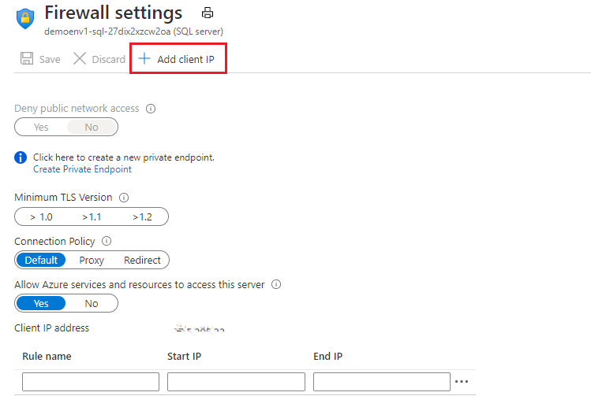

# Power BI Integration

Microsoft Community Training platform stores all customer data in the Azure SQL database which is part of customer's Azure Subscription. Customers can access the database to build custom reports (using analytics tools such as PowerBI) and run SQL queries for specific operations.

In this article, you will learn more about connecting Power BI with the Azure SQl Database to build custom reports for your organization.

## Connect to Power BI

### Prerequisites  

1. Administrator access to the Azure Portal where the Microsoft Community Training platform is hosted.
2. Azure SQL server User ID & Password. To view / retrieve your SQL Servers User ID & Password refer to [this document](database-schema.md).  
3. Storing Client IP to Firewall (If you are using a dynamic IP, make sure to add the same on the fire wall every time when it changes).
4. Access to Power BI Application in your organization.

### Step 1 - Obtaining Server Name

1. From your MCT’s SQL Database click on connection strings.

2. On the top bar select the option PHP.

    :::image type="content" source="../../media/image%28361%29.png" alt-text="select PHP on the nav bar":::

3. You will be able to view your SQL Databases server name and username (As highlighted in the below screen shoot)

### Step 2 – Connecting Power BI with MCT SQL Database

1. Open Power BI → click on the get data icon and select more.

    :::image type="content" source="../../media/image%28362%29.png" alt-text="Open Power BI, click on the get data icon and select more":::

2. Search and select Azure SQL database and click on the connect button.

    :::image type="content" source="../../media/image%28363%29.png" alt-text="Search and select Azure SQL database and click on the connect button":::

3. Enter your SQL DB server details and click on ok button.

    :::image type="content" source="../../media/image%28364%29.png" alt-text="Enter your SQL DB server details and click on ok button":::

4. Enter your database user name, password and click on the connect button

    :::image type="content" source="../../media/image%28365%29.png" alt-text="Enter your database user name, password and click on the connect button":::

5. Select the tables that you wanted to be imported and click on the load button. You may refer to our [Database schema](database-schema.md) for the entity relationship.

    :::image type="content" source="../../media/image%28366%29.png" alt-text="Select the tables to import and click on load button":::

6. Once you hit on load all your selected tables will be imported into Power Bi right pane and available under fields.

    :::image type="content" source="../../media/image%28367%29.png" alt-text="Loaded tables will be imported to PowerBI":::

7. Use the database schema from [this document](database-schema.md) to build relations required for your custom reporting requirements

## Sample PowerBI Reports

To help you get started on creating your own PowerBI reports here are some samples. These sample reports with their interactive visualizations can be used to create further customized reports for your specific requirements.

The pbix files for the sample reports can be downloaded from here -

>[**MCT PowerBI custom Dashboard.zip**](https://github.com/MicrosoftDocs/microsoft-community-training/files/7013084/MCT_Sample.Reports.PowerBI.zip)

To be able to start using this dashboard you will need to replace the existing data source and connect the .pbix file with your own [**Database**](database-schema.md).

### Steps to replace data source in PowerBI dashboard

If you already have your credentials for connecting to DB then proceed to step3.

1. Using [**connection strings**](#step-1---obtaining-server-name) get your server name, database username, and database name.

2. Obtain your password by [**Accessing Key Vault**](database-schema.md#accessing-key-vault).

3. Once you have credentials, server name, and database name we can go ahead to replace the data source in the dashboard provided. To do this we need to have [**Power BI**](/power-bi/fundamentals/desktop-getting-started) installed.

4. Open the .pbix file from the [**MCT PowerBI custom Dashboard.zip**](https://github.com/MicrosoftDocs/microsoft-community-training/files/7013084/MCT_Sample.Reports.PowerBI.zip) that you downloaded and open it from your Power BI Desktop and go to ‘File’ from menu bar.

    :::image type="content" source="../../media/BI_file.jpg" alt-text="file":::

5. Click on Options and Settings > Data Source Settings

    :::image type="content" source="../../media/BI_settings.jpg" alt-text="settings":::

6. Click on data source that you want to replace, and click Change Source.

    :::image type="content" source="../../media/BI_source.jpg" alt-text="source":::

7. Fill in your Server name, Database name.

    :::image type="content" source="../../media/BI_server.jpg" alt-text="server":::

8. Provide your login credentials that you collected from Azure Key vault as shown in image, make sure you have your Server name selected from dropdown of “Select which level to apply these settings to”

    :::image type="content" source="../../media/BI_credentials.jpg" alt-text="cred":::

9. Once connected, we need to Apply pending changes and click refresh for dashboard to reflect with newly connected data source.

    :::image type="content" source="../../media/BI_Refresh.jpg" alt-text="refresh":::

>[!Note]
>If in case you receive a firewall error while replacing data source, you may need to add your IP address in Firewall.
>
>
>
>To add client IP, click on add client IP and select the save icon
>
>
