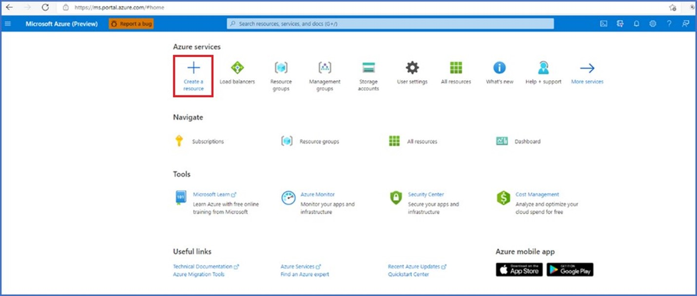
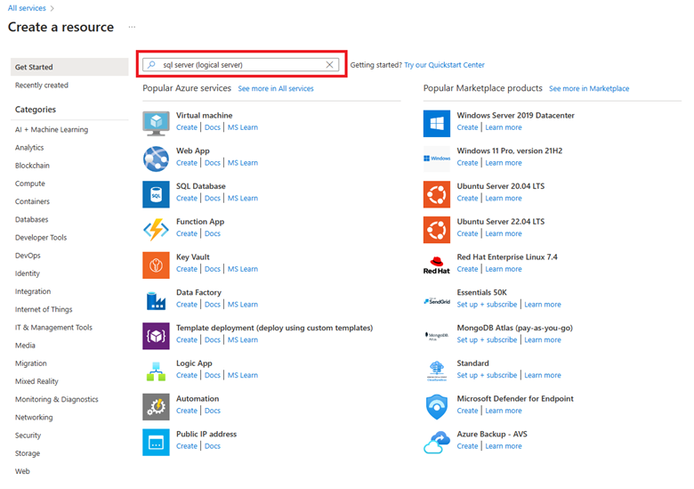
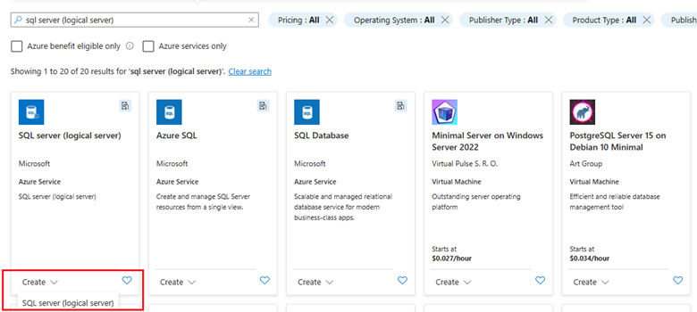
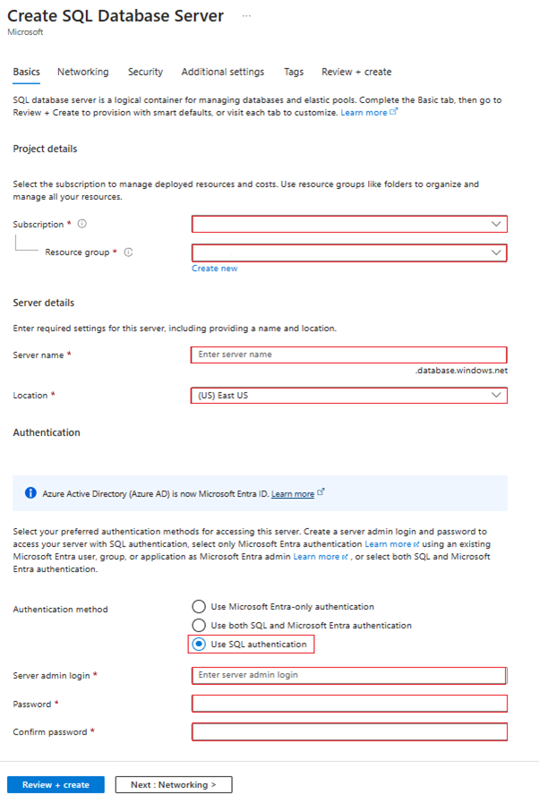
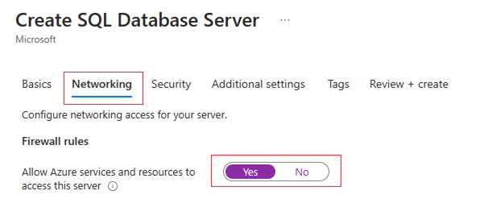
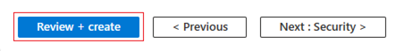
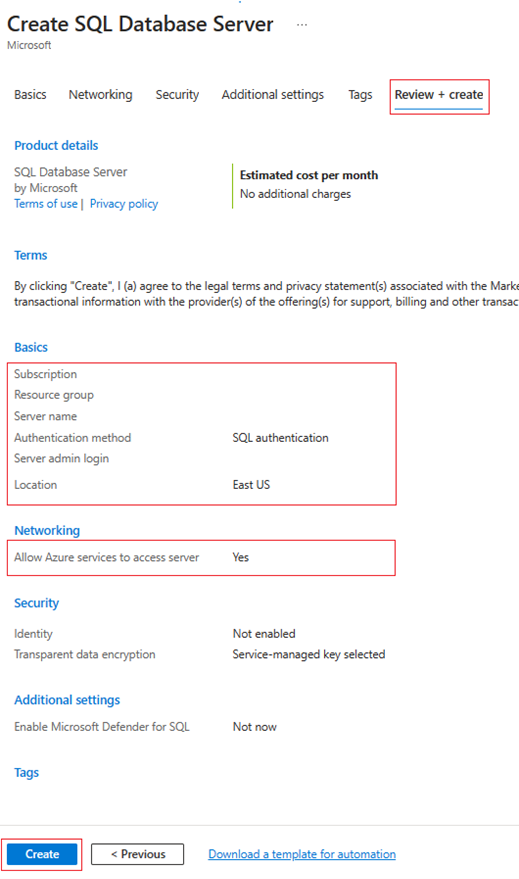
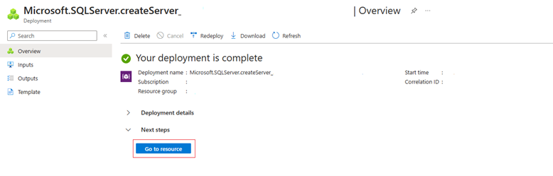
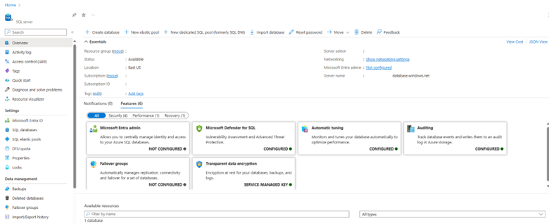

# Enabling Data Export 
In this tutorial, you will learn how to enable data export for your Community Training (CT) instance and prepare an SQL server in your subscription for hosting the exported data. With this option, you can export your Community Training instance’s data to an SQL server in your subscription and access your SQL server from other Azure services and resources, such as web apps, virtual machines, or Azure Data Factory and build custom workflows for your data. You will need an already existing Community Training instance and access to your Azure subscription to follow this tutorial.
##	Create an SQL server for data export
The following are the steps required to enable data export for your CT instance and prepare an SQL server for data export from CT.  
 
##	Step 1: Log in to Azure portal
Go to https://portal.azure.com and sign in with your Azure account credentials. You will see your dashboard with various Azure services and resources.

##	Step 2: Create an SQL server
On the left side of the dashboard, click on the 'Create a resource' button. This will open a new page with different categories of resources that you can create in Azure.  
 

On the search box, type 'SQL server (logical server)' and press enter. 
You will see a list of results related to SQL server. Select the 'SQL server (logical server)' option.

Click on the 'Create' button at the bottom of the page. This will open a new page with the configuration options for your SQL server.

##	Step 3: Configure your SQL server
On the configuration page, you will need to provide some basic information for your SQL server such as:
1.	Subscription 
2.	Resource group
3.	SQL server name
4.	Location
5.	Admin username
6.	Admin password  

You can choose any name for your server, as long as it is unique within Azure. Please choose the location as the region where you would want your SQL server and its corresponding data to be hosted. 

>[!Note]  
> **Please store the admin username and password carefully as these are the credentials that will be used to connect to your SQL server.**

After filling in the required fields, scroll down to the **'Networking'** section. Here, you will see the **'Allow Azure services and resources to access this server'** option. Please set this option as **‘Yes’** as this is needed for the export of data from your CT instance.

After configuring the security or additional settings as required or leaving the default settings for the security and additional settings as is, scroll down to the bottom of the page and click on the **'Review + create'** button.

This will validate your configuration and show you a summary of your SQL server settings. After verifying all the details, click on the 'Create' button to start the deployment of your SQL server.

 
## Step 4: Wait for the deployment to complete
After clicking on the 'Create' button, you will see a notification that your SQL server is being deployed. You can monitor the progress of the deployment on the 'Deployment details' page. The deployment may take a few minutes to complete.
Once the deployment is done, you will see a notification that your SQL server is ready. You can click on the 'Go to resource' button to view your SQL server details.

##	Step 5: View your SQL server details and contact CT support
After successful deployment, please navigate to the SQL server details page where you will see information about your SQL server, such as the subscription, the resource group, the server name, the location, the status and the firewall rules.
 

Congratulations, you have successfully created an SQL server in Azure to host your exported data from your CT instance. 

###	Contact CT support team 
Please contact CT support by raising a support request via the [helpdesk] (aka.ms/cthelpdesk) for enabling data export for your CT instance.
