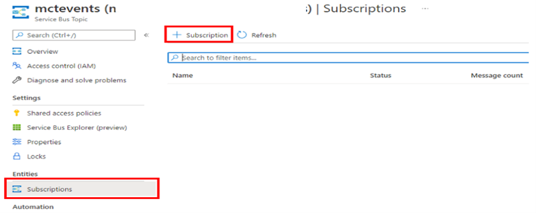
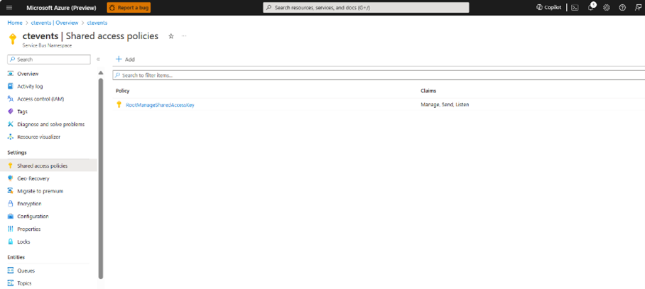
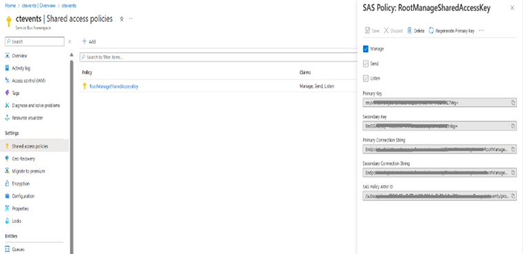

# CT Events Infrastructure
Community Training enables events infrastructure via the Azure Service Bus to enable you to track dynamic learner actions on the training platform.  

If you have been using CT events with public preview version and intend to use with GA version, this document will guide you through the steps. 

## Step 1: Add Azure Service Bus to your Subscription.
1.	Create a Service Bus Instance from Azure Portal following this documentation, with Topic Name: MCTEvents.

2.	Once the Topic is created, go to the topic -> Subscriptions (Under Entities on left panel) and click on + Subscription.

 
3.	Add the details in the Create Subscription page as per your requirement.

4.	Navigate to Shared Access Policies in the Service Bus.
 
 

5.	Click on the policy named RootManageSharedAccessKey. It will open a panel on the right side.
 

6.	Copy the Primary Connection String 

## Step 2: Add Azure Service Bus to your Subscription
Contact CT support by raising a support request via the [helpdesk](https://aka.ms/cthelpdesk) and share connection string details

## Step 3:  Set the scenarios

In the CT portal UI, you can set the scenarios, for which events need to be enabled in Settings -> Global Settings -> General section. 

## Events Enabled in Community Training
CT has enabled 4 types of events for customers to track dynamic learner actions on their training instance,
1.	Login Event: This will be called when the user explicitly signs in by clicking the Sign In URL in MCT during On-boarding or the AD B2C token of the learner is expired (generally every 90 days) when accessing via the Driver’s app.
2.	Course Start Event: This will be called when a learner starts a course, this is same as lesson starting since Grab only has 1 video lesson in the system (at least with the current migration)
3.	Module Completion: This will be the completion of either the lesson or the exam in the course
4.	Course Completion: This will be the Course Completion event sent once the Exam is passed
Sample Sequence of Events
Following will be the sequence of event for a learner accessing a course in MCT with 1 video and 1 lesson.
1.	LOGIN: When the learner clicks on Sign In button in MCT explicitly
2.	COURSE_START: Start of the Course which is equivalent to start of the Lesson or the Exam
3.	MODULE_COMPLETION: End of Video Completion
4.	MODULE_COMPLETION: Exam completed
5.	COURSE_COMPLETION: Course completed
6.	COURSE_START: UI re-rendering post exam completion
7.	COURSE_START: UI re-rendering post course completion

## Sample code to consume CT Events
Refer this [document](https://learn.microsoft.com/en-us/azure/service-bus-messaging/service-bus-dotnet-how-to-use-topics-subscriptions?tabs=passwordless) to access sample code for setting Azure Service Bus Integration to consume the events raised by the Community Training platform.

Sample event from CT    

Course Completion Event  
{  
"EventType": "COURSE_COMPLETION",  
"MessageBody": {  
"FirstName" : String, // First Name of the user  
"LastName" : String, // Last Name of the user  
"UserId" : Integer, // UserId of the user  
"Contact" : String, // Contact of the user  
"ContactType" : String, //"Email" or "Phone" or "AzureAD"  
"CourseName" : String, // Name of the course  
"CourseId" : Integer, // Id of the course  
"CompletionDate": String, // Course completion date  
"ExamPercentage": String, // Exam percentage, "Not Applicable" if no exam present.  
}

