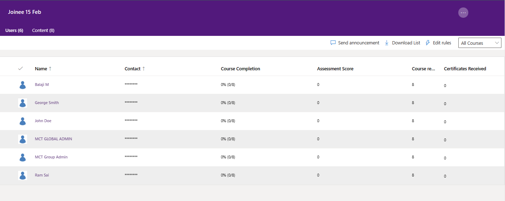

--- 
title: Group view
original-url: https://docs.microsoftcommunitytraining.com/docs/group-view-report
author: nikotha
ms.author: nikotha
description: Group admin are responsible to drive engagement and monitor course completion for learners on the ground.
ms.service: azure
---

# Group View

Group admins are responsible for driving engagement and monitoring course completion for learners on the ground. To support Group admins in these tasks,  Community Training provides group-level analytics to track learning progress for a cohort of learners and take relevant actions.

To access the Group View, you need to select a group from the list of groups under the Users tab in the portal. On the group details page, relevant information about learners' progress and course completion will be displayed to the administrator.

In this article, you will learn more about different metrics and reports available to Group administrators for all the participants in a group:

## Permissions Level

Community Training provides role-based administration and depending on the access level, administrators can perform various actions. The table below shows administrative roles which can access the Group View:  

|Access Level|  Group View|
 |---|---|
|Global Administrator| Yes |
|Organization Administrator |Yes|
|Category Administrator|No|
|Learning Path Administrator|No|
|Course Administrator|No|
|Group Administrator|Yes|

## Track overall learner progress and performance in a group

On the group details page, admins can view the list of all learners in a group along with course completion, average assessment score, courses enrolled by group admin, and certificates received.

* For example, the image shows the group analytics details for  employees in Digital Marketing:

    

In the grid view, for each learner, the group administrator can see the following information. You can hover over the column header to view the column definition:

1. **Course Completions**: Total number of courses completed by a learner from the list of courses assigned by the group administrator.

2. **Course Registrations**: Total number of courses assigned by the group administrator for a participant in the group.

3. **Assessment Score**: Average of the assessment score (including graded-assessment) of a learner across all the completed courses.

4. **Certificates received**: Number of certificates received by a learner for completed courses.

> [!Note]    
> The group details page shows the learner progress only for the courses assigned by the Group Admin. For example, suppose a learner has self-enrolled into some courses on the platform (not assigned by the administrator) then progress for such courses won’t be shown in the group details.

From the Group View grid, you can:

1. Select the respective column headings to sort the rows by any column.

2. Select **Download List** to download the data into an Excel sheet.

3. Select a row to [**view learner report card**](./learner-report-card-view.md) which provides learner’s progress and performance for individual courses.

4. Search for a learner in the group and access their progress and performance details.

    

5. Track the course completion status of all the users in the group for a specific course by selecting the Courses filter and selecting a specific course.

    

Please reach out to us [**via HelpDesk**](https://aka.ms/cthelpdesk) if you have any further queries.