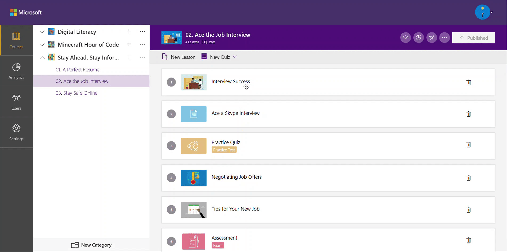

# Publish a course on the training portal

Any new course created on the Community Training management portal will not be accessible to the learners until it is published. This also means that any changes made to the course content (i.e. adding a new lesson, non-graded assessment, and graded assessment) will not come into effect until the new content is published.

In this article, you will learn how to publish a course on the management portal and what is required in preparation.

## Permissions Level

The Community Training portal provides role-based  permission levels. The table below shows which administrative roles can publish a course on the portal.

| Access Level  | Publish a course |
| --- | --- |
| Global Administrator | Yes |
| Organization Administrator | Yes |
| Learning Path Administrator | Yes |
| Category Administrator | Yes |
| Course Administrator | Yes |
| Group Administrator | No |

## How to publish a course

It is good prctice to go through the following checklist before publishing a course on the management portal:

1. Select   **View as Learner** icon on top right of the course details page to get a preview and experience how the learners would see and consume the course content whenever they login.  

1. Review the structure of the course and lesson sequence and rearrange, if necessary, by draging and droping the lessons into the required sequence.

    

1. Select **Publish** on right-navigation of the page to publish the course to the learners.

Please reach out to us [**via HelpDesk**](https://aka.ms/cthelpdesk) if you have any further queries.