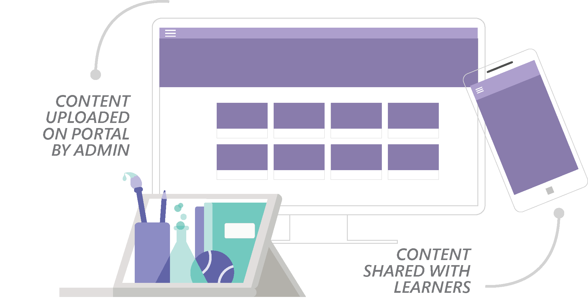

# Welcome to Community Training

Community Training is an Azure-powered online learning platform that enables organizations of all sizes and types to run large-scale training programs for their internal and external communities such as first-line workers, extended workforces, partner ecosystems, volunteer networks, program beneficiaries, and more.

Community Training is available as a an offering on the Azure portal that you can easily deploy in your subscriptions.

## Benefits of Community Training

The Community Training platform provides various benefits for both your organization and for learners:

### For your organization

Community Training supports personalized learning for large-scale mobile-based communities. It is affordable, easy to manage, and provides robust security and privacy protection. Your organization can leverage Community Training to:

1. Manage courses, users, and analytics all in one place with the management portal.

2. Empower managers, trainers, and facilitators on the ground to easily reach out to a widespread training audience and drive the adoption of your learning program.

3. Customize the look and feel of the platform and select learner endpoints for content consumption in line with your organization's needs.

4. Track learning progress and measure outcomes using rich out-of-box reports or create custom dashboards to monitor health and measure overall program success.

5. Leverage APIs to create your own training experience or integrate it into your existing systems (Coming Soon).

### For  learners

The user experiences on the platform are optimized for mobile-first and mobile-only users and are kept simple and visual to ease adoption. Your users can access courses any time, anywhere from their choice of devices. Your organization can deliver training to learners through the following means:

1. A white-labeled responsive web app - optimized for mobile devices.

2. A white-labeled Android mobile app - for tablets and smartphones.

3. Microsoft Teams.

4. API integration into customer-owned apps - available on request (Coming Soon).

## Management portal

The management portal is a one-stop shop for all administrative functions like uploading and managing courses, adding and organizing users, assigning courses and tracking completion, platform settings, and more.

The portal is designed based on role-based access control. This means that access to different functionalities is available to the users based on permissions relative to their roles. For more details, visit [this article](../get-started/user-role-and-management-portal-overview.md).

## Learner experience

Community Training is made for learning on the go. The user experience is optimized for learning with videos and assessments – even on low bandwidth or while offline. While accessing the course content, your learners can connect and interact with peers and experts in communities to enable social learning.  

Lastly, learners can also use the platform to track activities and stay updated on important updates from administrators.

**Next>** Learn about different [**user personas and their roles and responsibilities**](../get-started/user-role-and-management-portal-overview.md).
