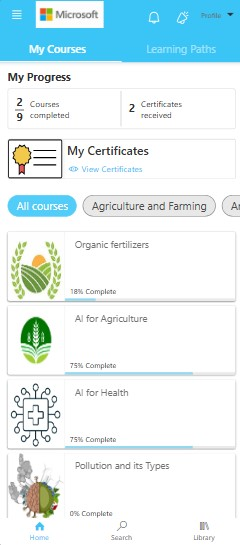
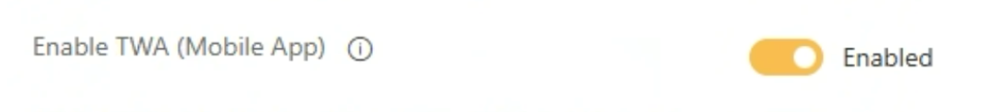
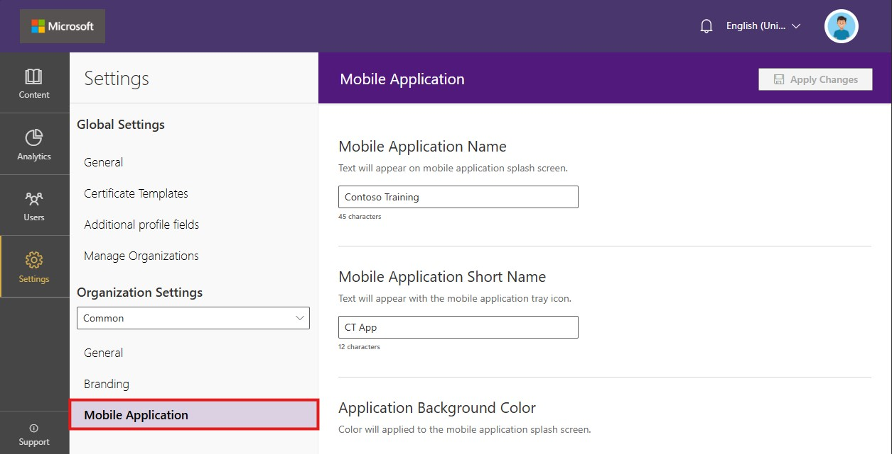
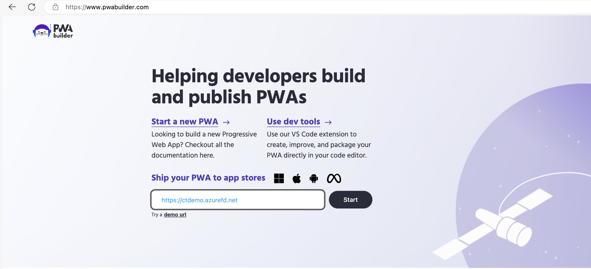
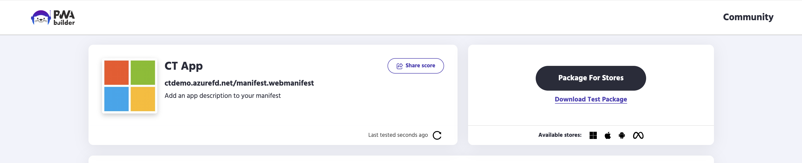
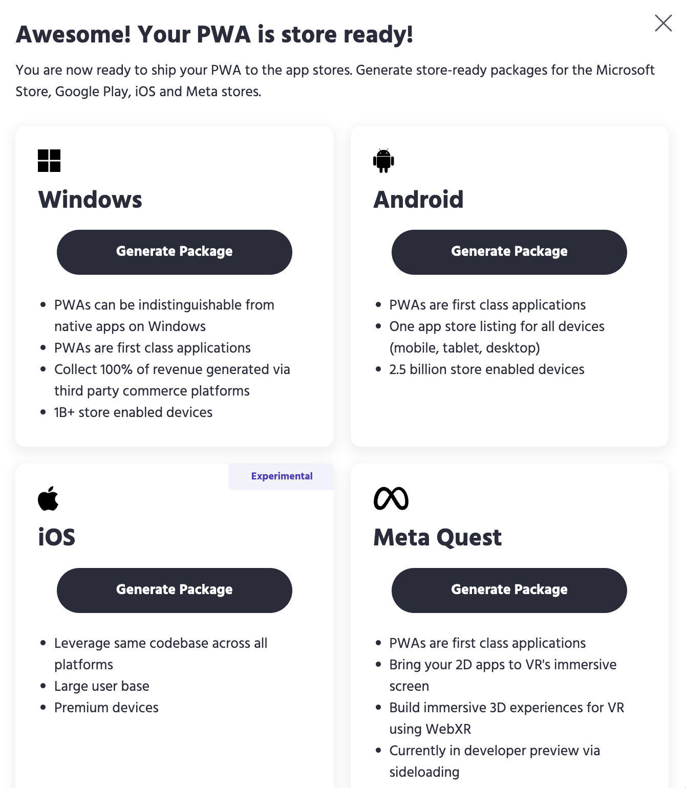
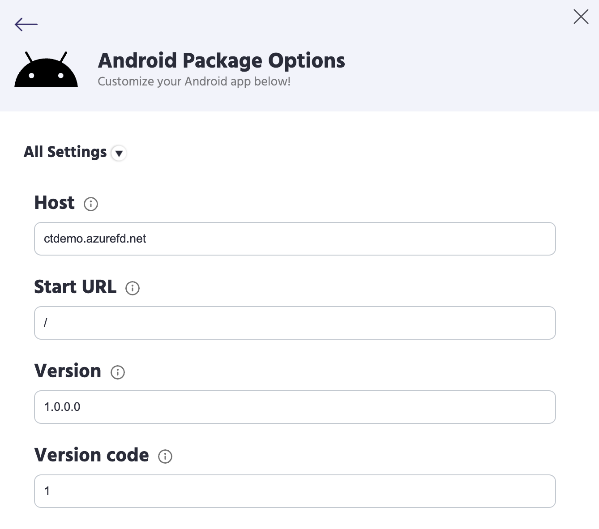
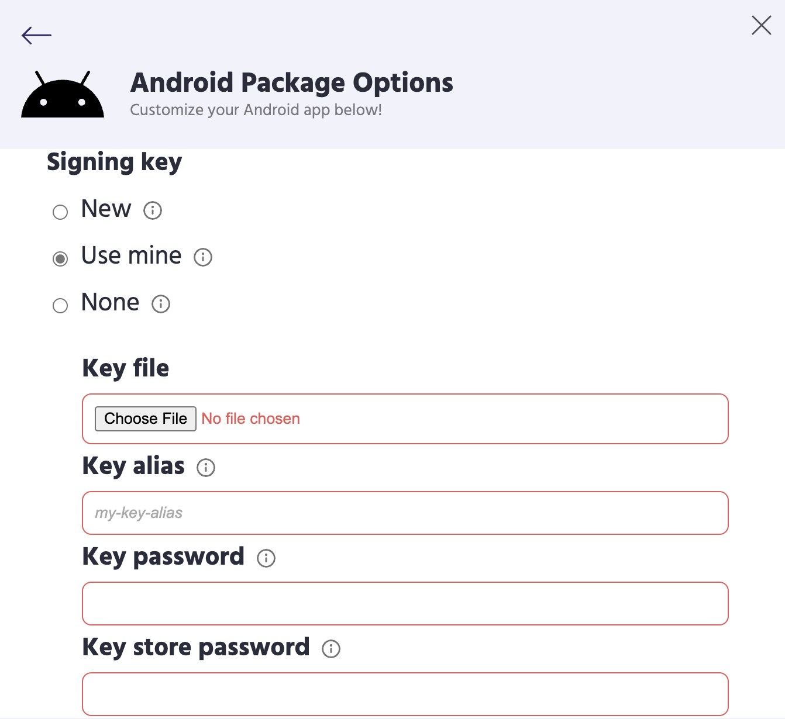

> [!IMPORTANT]  
> Community Training will reach end of support on Tuesday, April 7, 2026. No new deployments are available at this time. Existing Community Training customers will continue to receive security updates and technical support through Tuesday, April 7, 2026 at 11:59 pm. For more information or support, please reach out to our team here: https://aka.ms/cthelpdesk
# Create and Publish your Mobile App

In this article, we will learn about how to create and publish the Mobile App (available only for Android platform) for your training portal.  

### Pre-requisites for mobile application

#### Step 1: Update the configuration on the platform

1. Login as an Global Admin to your Community training portal and **switch to administrator view**.

2. Navigate to **Settings** option, click on **General** and check the **Enable TWA (Mobile app)** option under Admin settings section.

3. Once the option is enabled you will be able to see the **Mobile Application** option.

4. Under Mobile Application setting you need to specify following information, which will complete the pre-requisites:

    | Setting | Description |
    | --- | --- |
    | Mobile Application Name | You can specify your Instance name, this name will be used for rendering splash screen (Android), Start menu item (Windows) |
    | Mobile Application Short Name | This will be used to generate the App icon name on the device app tray. You can mention a shorter acronym of your instance name. |
    | Application Background Color | This setting will be used for rendering Splash screen (Android) |
    | Application Logo (512 px by 512 px) | The logo must be 512x512 pixels, MCT uses this image to render Splash screen, Start menu, App Launcher item for your PWA.  |

### For setting up the mobile app for your training portal, you will need a mobile app APK/AAB file and setup your Google PlayStore account. The APK/AAB file can be generated in two ways,

1. [Creating a progressive web application (PWA) for android](#option-1-creating-a-progressive-web-application-pwa-for-android)

2. [Requesting a TWA mobile app AAB from the platform team](#option-2-requesting-a-mobile-app-aab-from-the-platform-team)

## Steps to create Mobile Application

## Option 1: Creating a progressive web application (PWA) for android

### What are Progressive Web Applications?

[Progressive Web Apps](https://developer.mozilla.org/Apps/Progressive) (PWAs) provide access to open web technologies for cross-platform interoperability and provide your users with an app-like experience customized for their devices.

PWAs are websites that are [progressively enhanced](https://alistapart.com/article/understandingprogressiveenhancement) to function like installed apps on supporting platforms, and like regular web sites on other browsers.

The qualities of a PWA combine the best of the web and compiled apps. PWAs run in browsers, like websites, but have access to app features like the ability to work offline, be installed on the operating system, support push notifications and periodic updates, access hardware features, and more.

When installed, PWAs are just like other apps on Windows or Android. They can be added to the Start Menu, pinned to the Taskbar, handle files, run on user login on Desktop and in Android PWA will added as native application in app tray.

Since a progressive web app is a type of webpage/website known as a web application, they do not require separate bundling or distribution. By following simple [**Installation Requirements**](#installation-requirements-for-pwa-mobile-application) as mentioned below, administrators can enable PWA to be available for learners to install on their devices. With [**PWA Builder**](#generate-android-app-bundle-using-pwa-builder), you can then build android app for you PWA enabled instance.
<!--
### Installation Requirements for PWA mobile application

#### Step 1: Update the configuration on the platform

1. Login as an Global Admin to your Community training portal and **switch to administrator view**.

2. Navigate to **Settings** option, click on **General** and check the **Enable TWA (Mobile app)** option.

3. Once the option is enabled you will be able to see the **Mobile Application** option.

4. Under Mobile Application setting you need to specify following information:

    | Setting | Description |
    | --- | --- |
    | Mobile Application Name | You can specify your Instance name, this name will be used for rendering splash screen (Android), Start menu item (Windows) |
    | Mobile Application Short Name | This will be used to generate the App icon name on the device app tray. You can mention a shorter acronym of your instance name. |
    | Application Background Color | This setting will be used for rendering Splash screen (Android) |
    | Application Logo (512 px by 512 px) | The logo must be 512x512 pixels, MCT uses this image to render Splash screen, Start menu, App Launcher item for your PWA.  |
    -->

### Installing PWA on your Desktop and Mobile Device

1. Once the [Installation Requirements](#installation-requirements-for-pwa-mobile-application) for PWA are satisfied, as you login to your MCT instance you will be seeing an icon on the search bar of your browser indicating PWA app is available for installation.

2. Users can now install the PWA which renders your MCT webapp as a native application.

3. After successful installation, you can check options to allow the app to pin to taskbar, pin to start, create a Desktop shortcut as per your requirement.

4. For mobile devices (Android), users can install PWA by clicking on the prompt (add to home screen banner) that they receive while browsing your MCT instance or clicking on ‘install app’ from browser options.

> [!Note]  
> **Devices & Browser Compatibility:**
>
> * The PWA flow works as expected when using chromium-based browsers such as Microsoft Edge, Google Chrome.
>
> * For Firefox browser in desktop, the PWA install icon will not be seen on the URL bar, however the [service workers](https://developers.google.com/web/fundamentals/primers/service-workers) will be installed. In Mobile Firefox browser, you will have Add to home screen option that can install PWA.
>
> * Safari on iOS doesn’t support add to home screen banner, however the option is visible in the browser menu. You might notice some inconsistencies with PWA on iOS.

### Generate Android App Bundle using PWA Builder

As you enabled the PWA, in the backend there will be a [service worker](https://developers.google.com/web/fundamentals/primers/service-workers) and a [web manifest](https://web.dev/add-manifest/) added, through which you can build a native Android application that can be bundled to be uploaded to your play store. We recommend using [**PWABuilder**](https://www.pwabuilder.com/) an online GUI tool that can generate APK & AAB files for your instance.

#### Part 1: Steps to Generate Android App Bundle

1. Open [**PWABuilder**](https://www.pwabuilder.com/)

2. In the text box on homepage of PWA builder, enter your instance URL (eg: contosolearning.azurewebsites.net) and click ‘Start’. In the backend PWABuilder will verify if you have a service worker and manifest available for your PWA.

    

3. Click on **Package for stores**.

   

4. You will be redirected to page where you can generate Android App bundle, to the right in Android section, click on "Generate package".

    

5. In 'Android App Options' window:

    1. If you want to update an existing application then mention [**Package ID**](https://developers.google.com/android/management/apps#install_apps) of your previously published android app.

    2. If creating application for first time, you can choose to leave it with pre-populated ID.

    3. Provide App name and Launcher name for your application. **If creating application for the first time, then you can proceeed to Step 6 generating your app bundle**

    4. Click on “All Settings” and increment your App version and App Version Code by 1 from the version of your existing app, if creating the app for first time do not increment the value.

      

    5. Scroll to “Signing Key”, choose ‘Use Mine’ and upload the key store file that you received from MCT support team.

       

    6. Download your application bundle.

6. Finish the process by running a script with steps as mentioned in this [document](https://github.com/MicrosoftDocs/microsoft-community-training/files/8222196/PWA.Migration.docx) that will allow you for [Digital Asset linking](https://developers.google.com/digital-asset-links/v1/getting-started).

<!--
5. If you are creating an Android App for your instance for the first time (if you have an existing app and wanted it updated instead of creating new application, then proceed to step 6)

    * Provide App name and Launcher name for your application and click Generate.

        :::image type="content" source="../../media/PWA_android4.png" alt-text="PWAnewgenerate":::

6. If you have an existing android application published to play store and need to update it:

    * Log a [**help desk**](https://aka.ms/cthelpdesk) ticket requesting a key store file for your previous android application.
    * In the “Google Play store Options” mention [**Package ID**](https://developers.google.com/android/management/apps#install_apps) of your previously published android application.
    * Click on “All Settings” and increment your App version and App Version Code by 1 from your existing app version.
    * Scroll to “Signing Key”, choose ‘Use Mine’ and upload the key store file that you received from MCT support team.

        :::image type="content" source="../../media/PWA_Existingapp.png" alt-text="PWA exixting app":::

7. Download your Application Bundle.

#### Part 2: Digital Asset Linking

Through Digital Asset Linking a website can declare that it is associated with a specific Android app, or it can declare that it wants to share user credentials with another website.

This links protocol & API and enable an app or website to make public, verifiable statements about other apps or websites. [**Learn More about Digital Asset Linking**](https://developers.google.com/digital-asset-links/v1/getting-started)

##### Steps to Digital Asset Linking

1. Navigate to `<your-website-name>.scm.azurewebsites.net`
(If your instance url is contosolearning.azurewebsites.net then ‘contosolearning’ is your website name) and enter credentials which you used for azure portal when deploying MCT.

2. From Navigation bar on top, click on 'DebugConsole' and from dropdown click 'CMD'.

    :::image type="content" source="../../media/Digitalassetlinkscmd.png" alt-text="DALCMD":::

3. From the table of contents, navigate to `site/wwwroot/.well-known`
(create folder “.well-known” if it is not present )

    :::image type="content" source="../../media/Digitalassetlinkssite.png" alt-text="DLASite":::

4. Drag and drop the `assetlinks.json` file (present in app bundle that you downloaded from PWAbuilder) in `site/wwwroot/.well-known` path.

    :::image type="content" source="../../media/Digitalassetlinksfinal.png" alt-text="DLAFinal":::

5. you can now [upload](https://support.google.com/googleplay/android-developer/answer/9859152?hl=en&ref_topic=7072031&visit_id=637708323322373803-2268564924&rd=1) your AAB to your Play Store.

-->

## Option 2: Requesting a TWA mobile app AAB from the platform team

1. Complete the pre-requisites and visit [**Community Training Helpdesk**](https://aka.ms/cthelpdesk) to request the TWA.

2. Click on **Sign in** on the top-left corner of the homepage. Use your Azure AD or Social accounts to register and sign in.

3. Click on **Create Support Ticket** and enter the following values:

    | Field       | Description                 |
    | ----------- | ----------------------------|
    | Title       |Enter "Request a Mobile App" |
    | Type        |Select "Request”             |
    | Subject     |Select "Mobile App"          |
    | Description |Check Step 4                 |

4. Provide the following information in the **Description** section of the **Support Ticket** -
    
    * Portal URL - This is the instance of the platform for which the mobile app will be generated
    * Application Name - This is the name of the mobile app when published on playStore

        >**Sample Description Content**
        >
        >1. Portal URL - <https://contoso.azurefd.net/>
        >2. Application Name - Contoso Learning Center  
        >

5. That's all! You’ll receive a link on your contact email address to download the mobile AAB & APK files from our support team (in 4-5 business days).

### Steps to publish your mobile app to the playStore

#### Before you begin

1. Follow the steps above for creating your mobile app and ensure you have received the download link to your Mobile APK & AAB files from Microsoft.

2. We provide two files i.e., the APK & AAB file, you can use the APK file to test your app before publishing and to publish you may use the AAB bundle which contains support to multiple android versions and supports 32 & 64 bit.

3. [**Sign up on Google Play**](https://play.google.com/apps/publish/signup/) console in order to publish your app on  Google PlayStore.  

#### Steps to publish your mobile app

1. Download the AAB file to your computer from the email you received from our support team, after creating your Mobile App.

2. Follow the instructions given [**here**](https://support.google.com/googleplay/android-developer/answer/113469?hl=en&ref_topic=7072031) to upload and publish your APK on the Google Play Store.

    > [!Note]  
    > The steps to publish AAB files are similar to the steps used in publishing an APK file.

3. Once you have uploaded and published your AAB file, navigate to **Settings -> Users & Permissions**.

4. Click on “**Invite New User**”.

5. Enter the email address as **sangamdeployments@gmail.com**.

6. Leave Access Expiry date as **Never**.

7. Select the role as **Release Manager**.

8. Choose your mobile app from **Choose an App** dropdown.

9. Click on **Send Invitation**.

10. **Important**: Send an email note to the Community Training team that the permission has been shared. You can reply to the  email chain in which AAB file was shared with you.

> [!Note]  
> 
> * If there is any change/update in login type configuration on your instance then the mobile application needs to be updated. 
> * Office files are accessible only in TWA.

Please reach out to us [**via HelpDesk**](https://aka.ms/cthelpdesk) if you have any further queries.
