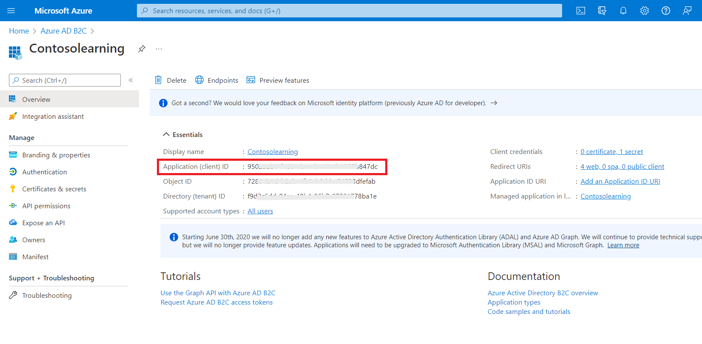
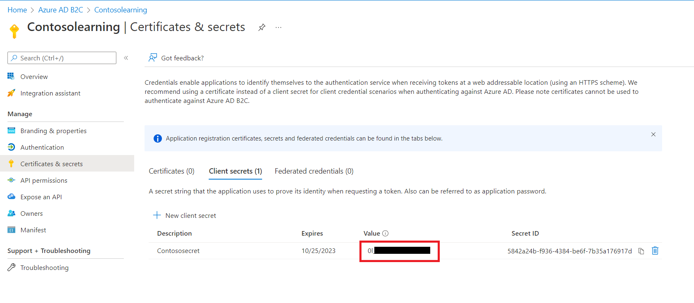
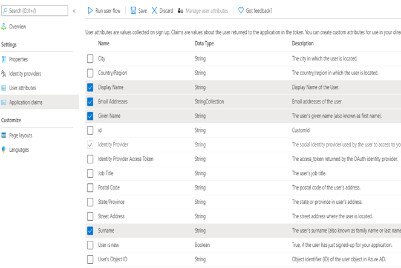
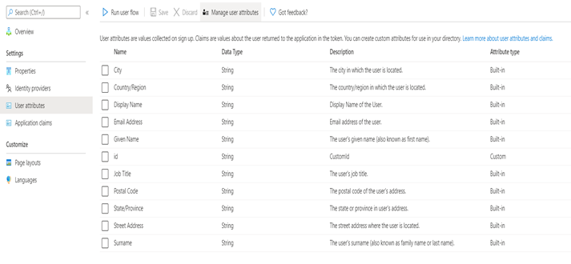
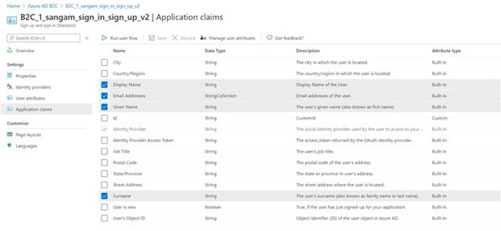
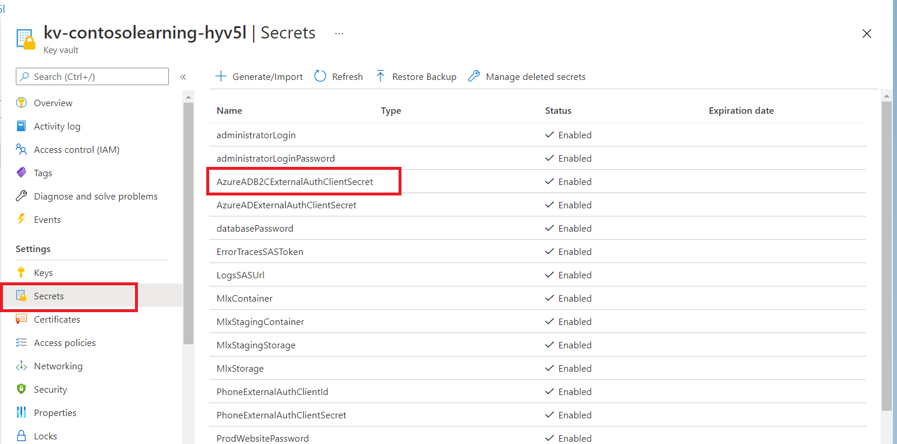
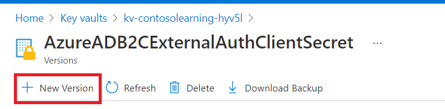
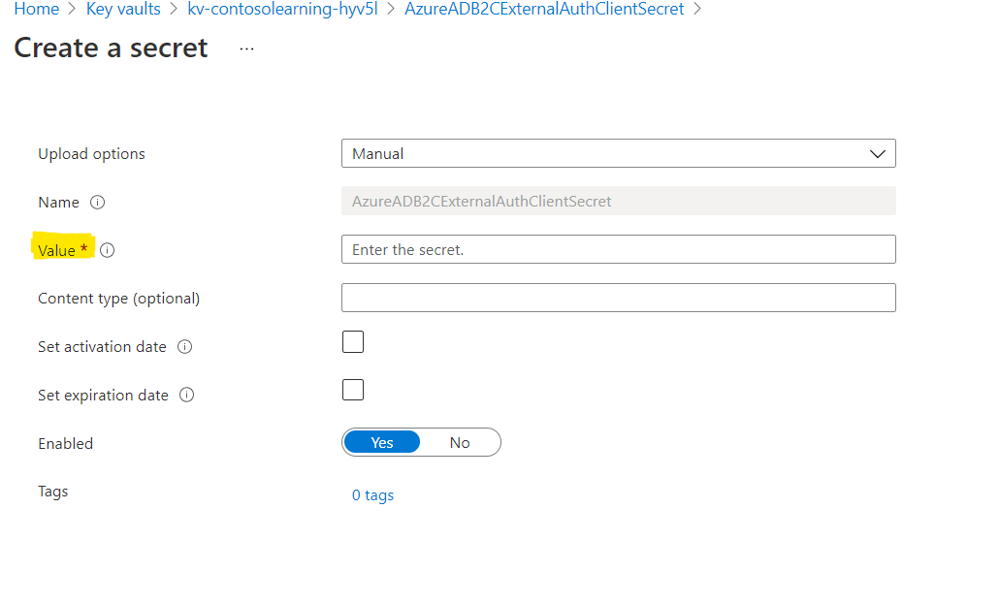
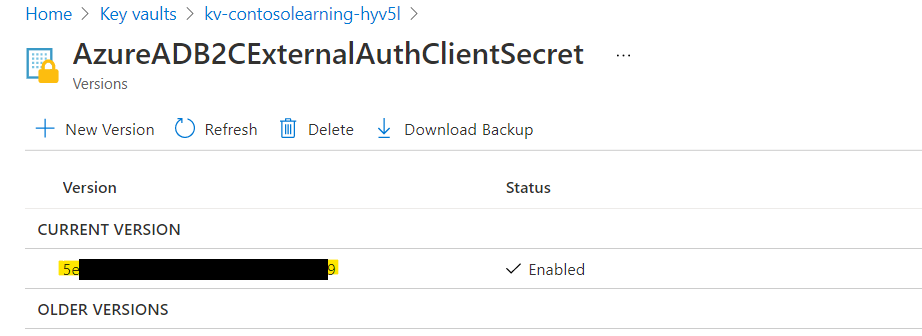
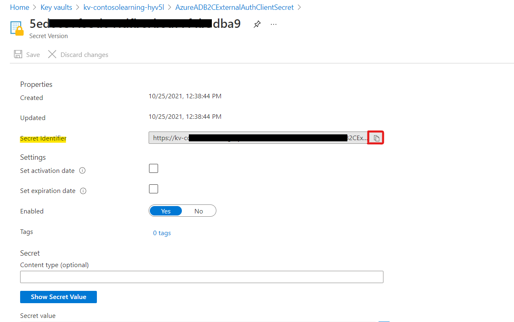

> [!IMPORTANT]  
> Community Training will reach end of support on Tuesday, April 7, 2026. No new deployments are available at this time. Existing Community Training customers will continue to receive security updates and technical support through Tuesday, April 7, 2026 at 11:59 pm. For more information or support, please reach out to our team here: https://aka.ms/cthelpdesk
# Steps to setup ADB2C for GA readiness

### Step 1 - Setup your Azure AD B2C

You can create a new Azure AD B2C tenant or create an existing one based on your organization requirement.

1. Login to [**Azure portal**](https://portal.azure.com/).

2. Create a new [**Azure Active Directory B2C**](/azure/active-directory-b2c/tutorial-create-tenant)  tenant.

3. Link the Azure Active Directory B2C tenant just created to your Azure subscription.  

### Step 2 - Create Azure AD B2C application

 

> [!Note]  
By the end of this section, please have the following details copied on a notepad:
>1. Client ID
>2. ADB2C Tenant Name
>3. ADB2C Client Secret
>4. Sign Up and Sign In userflow name

Here are the steps an create on Azure AD B2C tenant and link the same with your training portal instance.

1. Create a new Azure AD B2C application by following [**this article**](/azure/active-directory-b2c/tutorial-register-applications). Please ensure application properties are set as following:
    1. Web app / Web API - set to "Yes"
    2. Allow implicit flow - set to "No"
    3. Add following to **Reply URL**
        1. "https://*name*.azurefd.net/signin-b2c"
        2. "https://*name*.azurewebsites.net/signin-b2c"
        3. "https://*name*-staging.azurewebsites.net/signin-b2c"
    where "name" corresponds to your website name.
2. Copy the Application ID value to be required later for **Client ID**.

    

3. In your Application, under Manage, go to **Certificates & Secrets** and click on **Generate Key**.
4. Click on **Save** and the app key will appear. Copy the value to be required later for **Client Secret**.  

    

5. Go to Azure Active Directory from the left menu of your Azure portal, click on Domain Names and copy the tenant name under Name to be required later for **Tenant Name**. For example, if the default domain for your Azure AD tenant is **contoso.onmicrosoft.com**, then enter **contoso**.
6. Refer [**this article**](/azure/active-directory-b2c/tutorial-create-user-flows) article to create a **signing flow** (a sign-up and sign-in user flow) and a **password reset flow** (for local account)
    * Select Email Addresses, Given Name, Identity Provider and Surname in Application claims
    * Application claims should be same as following screenshot
    
    * Don’t select any Sign-up attributes
    
    * Copy the user-flow(s) name to be required later (These will be required during MCT platform installation)
    >
    > [!NOTE]
    > Setting Password Reset Flow for an Existing Deployment:
    > If you are setting up the **Password reset flow** on an existing deployment with Azure AD B2C authentication:
    >
    > 1. Set Userflow Name as **pwd_reset** (Step #1 in Create Flow using steps in [**this article**](/azure/active-directory-b2c/tutorial-create-user-flows)
    >
    > 2. Add the following URLs in the **Reply URL** section,
        >
        > * `https://*name*.azurefd.net/signin-b2c-pwd`
        > * `https://*name*.azurewebsites.net/signin-b2c-pwd`
        > * `https://*name*-staging.azurewebsites.net/signin-b2c-pwd` where "name" corresponds to your website name.
        >
    > 3. Open **App Service** and add the following configurations both with value as **B2C_1_pwd_reset**,
        >
        > * AzureADB2CPasswordResetPolicy
        > * idp:AzureADB2CPasswordResetPolicy
        >
        >  

Make sure you have the following details on a notepad before starting the next steps:

1. Client ID
2. ADB2C Tenant Name
3. ADB2C Client Secret
4. Sign Up and Sign In userflow name

### Step 3 - Configure your Identity provider

Here are the steps to create policies based on the Identity Provider:

1. **Configure the identity provider** – based on your chosen provider such as [**Microsoft**](/azure/active-directory-b2c/active-directory-b2c-setup-msa-app), [**Google**](/azure/active-directory-b2c/active-directory-b2c-setup-goog-app) and [**Facebook**](/azure/active-directory-b2c/active-directory-b2c-setup-fb-app)

2. **Configure you Local Account** - You can configure local account for your training portal by following the instructions below:

    1. Navigate to the Azure AD B2C tenant.
    2. Under Policies select User Flow and click on the required User Flow from the populated list.
    3. Under Settings, select Identity Providers and check whether the configuration matches exactly as below.

        

    4. In the same window, select Application Claims and check whether the configuration matches exactly as below.

        

    5. Select User Attributes and ensure no options are selected.
   
Copy and note ClientID, ClientSecret, TenantName, sign-up and sign-in user flow name while configuring ADB2C tenant.

Navigate to CT instance Application’s [**Key-Vault**](../../analytics/custom-reports/database-schema.md#accessing-key-vault):

* Click on “AzureADB2CExternalAuthClientSecret” in Secrets under settings

* Create a new secret version.  

* Paste the ADB2C application ClientSecret that you previously copied as Value and click save.

* Now, with in AzureADB2CExternalAuthClientSecret, click on newly created secret version and copy Secret Identifier.  

        

Navigate to [**configurations on the Training Platform**](../../settings/configurations-on-the-training-platform.md#steps-to-set-the-configurations-on-the-platform), search and update the following app settings (create new application settings if not already present)

| **Application Setting**                || **Value**                                  |
|----------------------------------------||--------------------------------------------|
| idp:AzureADB2CExternalAuthClientId     || Paste the ClientID of ADB2C application    |
| idp:AzureADB2CExternalAuthClientSecret || Paste the Secret Identifier from Key vault |
| idp:AzureADB2CExternalAuthTenant       || ADB2C Tenant Name                          |
| idp:AzureADB2CExternalAuthPolicy       || Sign-up ans Sign-in User flow name         |
| idpSelection                           || 1                                          |

