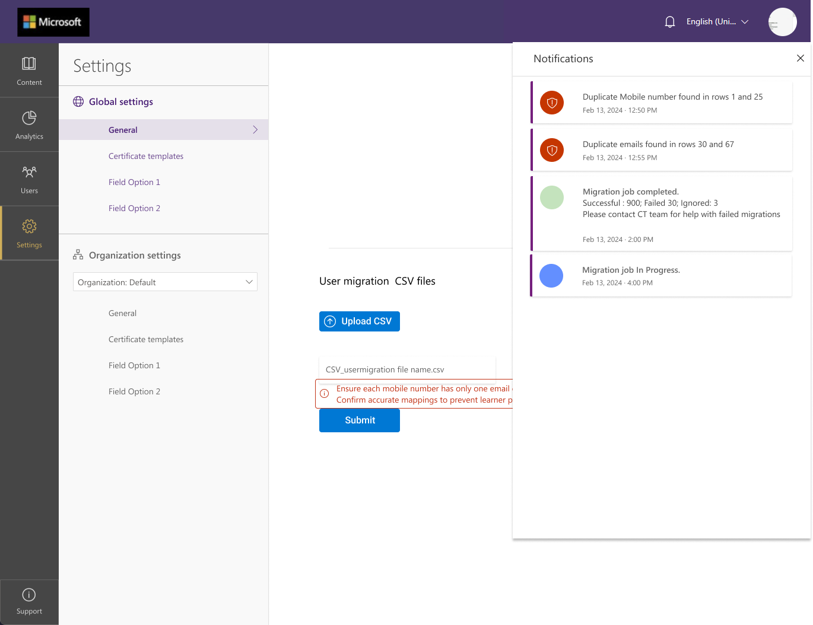
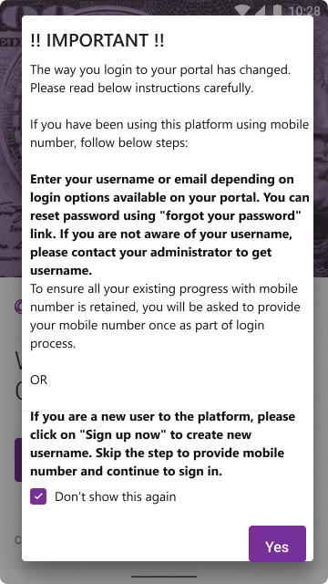
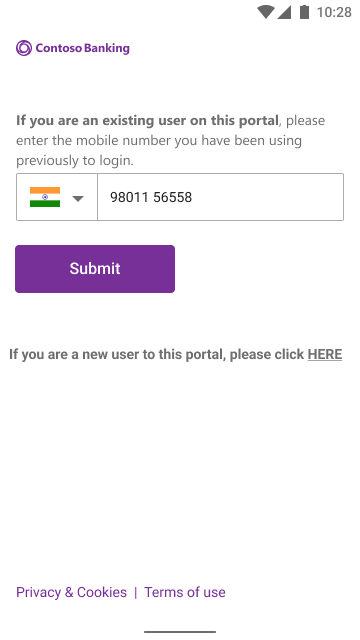
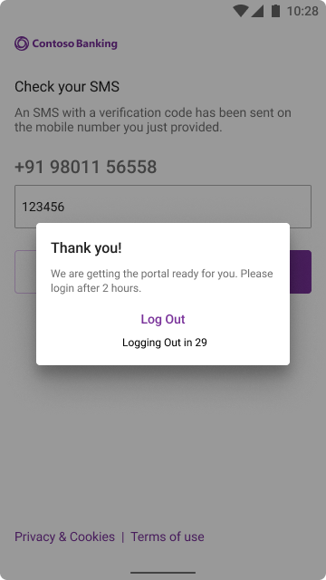

> [!IMPORTANT]  
> Community Training will reach end of support on Tuesday, April 7, 2026. No new deployments are available at this time. Existing Community Training customers will continue to receive security updates and technical support through Tuesday, April 7, 2026 at 11:59 pm. For more information or support, please reach out to our team here: https://aka.ms/cthelpdesk
# Community Training Phone based Identity Migration

The Microsoft’s Community Training, in its efforts to provide a better service and security on its platform, is ending the support for the Phone based identity Authentication service by 30th April 2025 and is providing [the Azure ADB2C](https://learn.microsoft.com/en-us/azure/active-directory-b2c/) service as its alternative.

# What is Azure ADB2C:

Azure Active Directory B2C (Azure AD B2C) is a customer identity access management (CIAM) solution that enables you to sign up and sign in your customers into your apps and APIs. Your customers use their preferred social, enterprise, or local account identities to get single sign-on access to your applications. Learn more about ADB2C [here](https://learn.microsoft.com/en-us/azure/active-directory-b2c/overview).

The process for setting up ADB2C on Community Training  is detailed in this [document](../Phone_Auth_Migration_Files/ADB2C.md).

# Identity Options

ADB2C provides following identity options

1.  **Migrate to an ADB2C provided phone Identity**:
    -   To use the phone-based Identity for your learners by using the phone Identity by ADB2C. Pricing details for ADB2C for SMS can be referred here [**Pricing - Active Directory External Identities \| Microsoft Azure**](https://azure.microsoft.com/en-us/pricing/details/active-directory-external-identities/)
    -   Please refer [**this documentation**](https://learn.microsoft.com/en-us/azure/active-directory-b2c/tutorial-create-user-flows?pivots=b2c-user-flow) from ADB2C for setting this service using the Custom Policies. We have created a sample custom policy for you. Please feel free to use this to get started [**LINK**](https://learn.microsoft.com/en-us/azure/industry/training-services/microsoft-community-training/GA-version/media/Phone_Auth_Migration_Files/ReadME)
2.  **Migrate to a social Identity via ADB2C**:
    -   To use identity providers such as Google, Facebook, Microsoft, or your organization to log in to the platform, please refer [**Configure login identity for the platform | Microsoft Learn**](https://learn.microsoft.com/en-us/azure/industry/training-services/microsoft-community-training/public-preview-version/infrastructure-management/install-your-platform-instance/configure-login-social-work-school-account)
3.  **Migrate to a username and password-based Identity**:
    -   To allow your learners to login via a username and password as login identity, please refer . [**Tutorial - Create user flows and custom policies - Azure Active Directory B2C | Microsoft Learn**](https://learn.microsoft.com/en-us/azure/active-directory-b2c/tutorial-create-user-flows?pivots=b2c-user-flow).

# Migration Process

The Migration process involves the following steps:

1.  Customer will setup the ADB2C on their subscription based on identity options selected.
2.  Customer will inform the Community Training  team via [**helpdesk**](https://aka.ms/cthelpdesk) once ADB2C set up is complete.
    Customer have to update the following app settings (create new application settings if not already present):
    
    | **Application Setting**                || **Value**                                  |
    |----------------------------------------||--------------------------------------------|
    | PhoneAuthMigrationEnabled              || True                                       |
    | PhoneAuthMigrationEnabledDate          || Enter Enabling Date in 'MM/DD/YYYY' format |
    | PhoneBaseEndpoint                      || https://phoneverification.azurefd.net      |

    Rename the App Setting of 'idp:PhoneExternalAuthClientId' to 'PhoneAuthClientId'. Don't change the value
        

4.  Community Training  Team will implement the necessary steps to enable migration to new identity and retaining their progress.

The Migration can happen in either of the two ways:

1.  Administrator driven Migration.
2.  Learner driven Migration.

## Administrator driven Migration

This is for scenarios where your administrator already knows the mapping between existing mobile number and new identity (username/email for the learners.
 
>[!NOTE]  
> In this case, you will have to communicate the new identity (for eg: username) to the respective learners who can login by resetting their passwords.

### Migration Steps:

1.  Administrator logs in to the Community Training  portal using the new ADB2C Global Admin login credentials (eg: Username/email) and navigates to Admin view

    Follow the steps Under “Migration into Microsoft’s ADB2C Identity“ in “Settings” tab. The status of the migration and the errors (If any) will be shown in the notifications.    

A template file is provided on the UI. It can also be downloaded from here: [template File](../../media/Phone_Auth_Migration_Files/IdentityMigration.csv)

>[!Note]  
> Please ensure that there are no duplicates in the mappings file – i.e. one mobile number should be mapped to only one email/username.* An incorrect mapping may result in the historical learner progress and certificates being mapped to a different learner.

>[!Note]
> Please Ensure that the required data is only in three columns. i.e., Country Code, Phone Number and the new identity. Please delete data in other columns. 

2. The status of migration can be seen in the notifications.   

## Learner driven Migration

This is for scenarios where you would like the learners to migrate their identities using a simple UI navigation that is presented to them upon login.

> [!Note]  
> Based on the login type you select; the learner may have to sign themselves up or reset their password.

### Migration Steps:

1.  The learner will sign in/sign up in Community Training  portal. They will see a message on the sign in page.   

2.  Existing learners, will be presented with a screen to input their mobile number that was used previously to login to the platform. On successful confirmation of the mobile number, the learner will be sent an OTP (One Time Password) for validation.  

> [!Note]  
> New users should skip this step to provide mobile number and proceed to learner’s home page in portal.  

3.  Post validation, the learner progress will be migrated to the new identity in 30 minutes.  

   

# FAQs

1.  The learner has reached out to admin informing that the migration has failed.  

    A.  Please raise a ticket with the Community Training  Team on [**Community Training  Helpdesk**](https://aka.ms/cthelpdesk) with following details:  
      1.  Website name  
      2.  Learner identity (for eg: email/username)  
      3.  Learner Mobile Number on the platform  

2.  What If the Learner has more than one account – one phone-based Identity and other email/username-based Identity and would like to reuse both identities.  

    A.  Community Training  does not support multiple identities for same leaners so learner needs to pick one identity.

3.  Will the website home page (landing page) message will be shown to all users?  

    A.  Yes! Until migration is completed, this will be shown to all the users until the learner select the “Do not show again” check box on the message.

4.  What if the learner is disconnected from the screen before they could complete the necessary steps?  

    A.  The learner will see the UI again, until they Complete necessary steps for identity migration.

5.  How should a new learner on the platform proceed?  

    A.  If the learner has just signed up on the platform, they need to skip the step to input their mobile number and proceed to the My Courses page.

6.  What if an existing user on the platform accidentally clicked on the “If you are new user on the platform, please Click Here” link. How can they use the identity migration flow?  

    A.  Please submit the email and mobile number to their Admin who can use Community Training  UI in ‘Settings’ tab to map new identity.

7.  Do we have to create a user in the B2C tenant every time a new user is added?  

    A.  This will depend on user sign up options defined in B2C tenant settings.  

  
  Please reach out to us [**via HelpDesk**](https://aka.ms/cthelpdesk) if you have any further queries.
