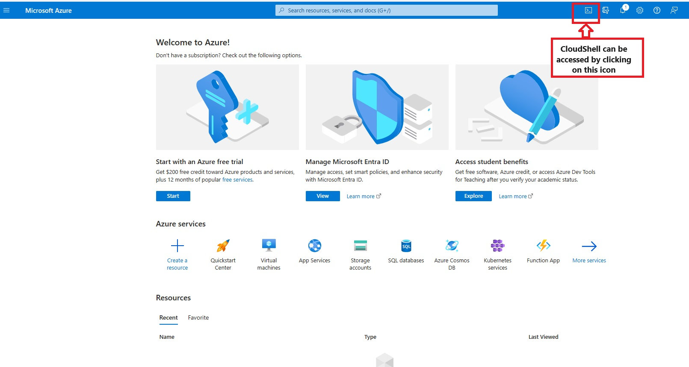

# Azure ADB2C Native Phone Authentication Setup
As of today, Community Training Engineering develops and maintains a Phone Number OTP based identity provider based on the OpenIDConnect (OIDC) protocol. The team is in the process of migrating the customers using Community Training Phone Authentication to Azure ADB2C Native Phone Authentication.

This script can be used by customers to setup the custom user journey for ADB2C Native Phone Authentication for their Community Training instance.

## Important
The script and configuration currently only sets up phone based OTP authentication mechanism. Multi-auth scenarios are not yet solved for the custom policy implementation.

## Adding Native ADB2C's Phone Auth to your instance
If the customer has to be migrated to ADB2C Native Phone Authentication from CT Phone Authentication:

1. Follow ***step 1*** to ***step 2 (till sub-step 5)*** from the social auth setup docs [Setup Social Authentication for Community Training](/azure/industry/training-services/microsoft-community-training/public-preview-version/infrastructure-management/install-your-platform-instance/configure-login-social-work-school-account#social-account-or-email-based-authentication)
2. Open [Azure Portal](https://portal.azure.com)
   
3. Ensure that the account being used has App Creator access in the tenant and Owner access for the subscription.
4. Open cloud shell in Azure Portal. 

     

>     [!Note]  
>     If cloud shell is not setup previously, please follow the on-screen instructions to setup cloud shell.

5. Download the setup script and configuration files using the following commands
    - `wget -q https://raw.githubusercontent.com/MicrosoftDocs/microsoft-community-training/live/microsoft-community-training/media/Phone_Auth_Migration_Files/setup.ps1 -O ./setup.ps1`
6. Get the tenantId and fully qualified domain name of the Azure ADB2C tenant
    - tenantId should be a globally unique identifier (guid)
    - fully qualified domain name should look like ***\<your-domain\>.onmicrosoft.com***
7. Run the setup script using the following command
    - `./setup.ps1 -tenantId <tenantId> -domainName <domainName>`
    - Replace `<tenantId>` and `<domainName>` with the values from step 6 respectively.

>   [!Note]  
>   If you would like to have Google Auth Along with Native ADB2C Phone Auth, run the following command:
>    - `./setup.ps1 -tenantId <tenantId> -domainName <domainName> -enableGoogleAuth`    
 >       Running this will prompt you to enter the Google's secret entries associated with your domain.   
  

8. The script completes successfully when it outputs the ***AuthPolicyName*** and ***GraphApiManagementAppSecret***. Copy the ***GraphApiManagementAppSecret*** and store securely for later use.
9. Update the following values in the app service configurations.   
Refer here: [ App Service Configurations](/azure/industry/training-services/microsoft-community-training/public-preview-version/settings/configurations-on-the-training-platform#steps-to-set-the-configurations-on-the-platform)
    - **idp:AzureADB2CExternalAuthPolicy** - **AuthPolicyName** from the script output as mentioned in step 8.
    - **idpSelection** - 1

