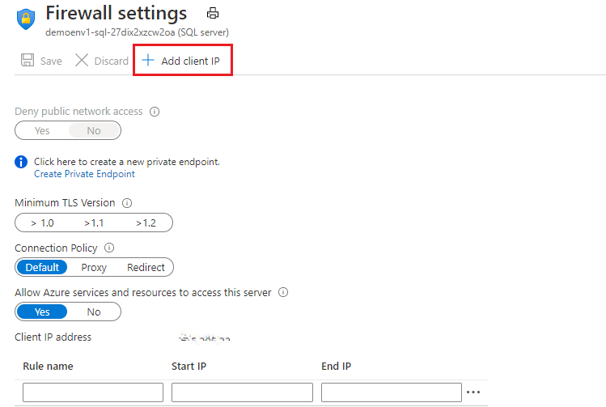

# Database Schema

 Community Training platform stores all customer data in the Azure SQL database which is part of customer's Azure Subscription. Customers can access the database to build custom reports (using analytics tools such as PowerBI) and run SQL queries for specific operations.

In this article, you will learn more about the platform's database schema and its components and usage.

## Database Schema Overview

[** Community Training - DB Schema Overview.pdf**](https://github.com/MicrosoftDocs/microsoft-community-training/files/12378831/Microsoft.Community.Training_DB.Schema_Aug.2023.pdf)

### Previous Versions

* [** Community Training - DB Schema Overview_Aug_2023.pdf**](https://github.com/MicrosoftDocs/microsoft-community-training/files/12378831/Microsoft.Community.Training_DB.Schema_Aug.2023.pdf)

* [** Community Training - DB Schema Overview_Mar_2023.pdf**](https://github.com/MicrosoftDocs/microsoft-community-training/files/10917137/MCT_DB.Schema_Mar.2023.pdf)

* [** Community Training - DB Schema Overview_Aug_2022.pdf**](https://github.com/MicrosoftDocs/microsoft-community-training/files/9754128/MCT_DB.Schema_Aug2022.pdf)

* [** Community Training - DB Schema Overview_May_2022.pdf**](https://github.com/MicrosoftDocs/microsoft-community-training/files/8511863/MCT_DB_Schema_Apr2022.pdf)

* [** Community Training - DB Schema Overview_Jan_2022.pdf**](https://github.com/MicrosoftDocs/microsoft-community-training/files/7889844/MCT_DB_Schema_Jan2022.pdf)

* [** Community Training - DB Schema Overview_Oct_2021.pdf**](https://github.com/MicrosoftDocs/microsoft-community-training/files/7581669/MCT_DB_Schema_Oct2021.pdf)

## Accessing Database

Following are the two ways to access the MCT Database,

### Method 1: Using Connection string

Go to the MCT portal's SQL database from the Managed resource group (Find the dapclp-db-xxxxxxxxx SQL database).
Click on Setting > Connection strings to get the connection strings for the SQL database, as in the below image,

   

### Method 2: Use Username and Password (Online Azure query editor)

Go to the MCT portal's SQL database from the Managed resource group (Find the dapclp-db-xxxxxxxxx SQL database).

1. Select Query Editor

    

2. This query editor will ask for username and password that can be retrieved from key-vault. (Go to resource group and select key vault).

    

## Accessing Key Vault

> [!IMPORTANT]  
> If you are facing a “Key Vault” issue when trying to get password of Admin user for MCT Database in Azure with the error - "The operation “List” is not enabled in this key vault’s access policy" also please follow the following steps.

Go the key vault (login to your [Azure portal](https://ms.portal.azure.com/), search & click on 'Key vaults', click on key vault corresponding to your application's resource group). By default, user does not have access permission to view the keys, secrets and Certificate information stored in Key Vault. To gain access, follow below steps,

1. Select Access Policies from the Key Vault resource blade (See below screenshot, In setting Tab there is Access policies)

    

2. Click the [+ Add Access Policy] button at the top of the blade

    

3. Select Secret Management” in Configure from template (Optional)

    

4. Click Select Principal to select Email address you signed in.

5. Save changes

6. Go to the Secrets

7. Find username and password

    

8. Select the password as shown in above screenshot.

9. Then click on the current version, click on "Show Secret Value" button in the right pane, you can see the Password for the selected item

**Note**: You may need to add your IP address in Firewall.

To add client IP, click on add client IP and select the save icon

## Executing SQL Queries

1. To run a SQL query go to your Azure portal and click on **Query editor**

    

2. The admin to login to the above portal can be obtained from **Key vault**. See [accessing Key vaults](./database-schema.md#accessing-key-vault) section for more details.

    
