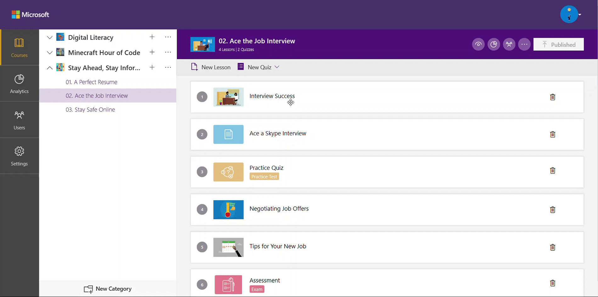

# Publish a course on the training portal

Any new course created on the  Community Training management portal will not be accessible to the learners unless and until it is published. In other words, any changes made to the course content (i.e. adding a new lesson, quizzes and exam) will come into effect only when changes are published.

In this article, you will learn about steps admin needs to perform before publishing a course on the management portal:

## Permissions Level

The  Community Training  management portal provides role-based administration and depending upon the type of access level admins can perform an action on the portal. Table below shows administrative role which are allowed to publish a course to the learners on the portal:

| Access Level  | Publish a course |
| --- | --- |
| Global Administrator | Yes |
| Organization Administrator | Yes |
| Learning Path Administrator | Yes |
| Category Administrator | Yes |
| Course Administrator | Yes |
| Group Administrator | No |

## Steps to perform before publishing a course

We recommend administrators to go through the following checklist before publishing a course on the management portal:

1. Click or tap   **View as Learner** icon on top right of the course details page to get a preview and experience how the learners would see and consume the course content whenever they login.  

2. Rearrange the structure of the course and lesson sequence using simple drag and drop operation.

    

3. Click or tap **Publish** on right-navigation of the page to publish the course to the learners.
