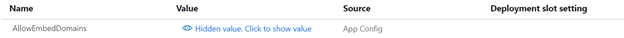

# Content and Course management

## Content Library

### Does the platform come with any Out-of-Box content for organization to kickstart the training program?

 provides course content around Digital Literacy, Office 365, etc. which organization can upload and use in their  Community Training platform instance. You can browser our content catalogue **[here](https://sangampartners.azurewebsites.net/)**.

Please contact us  via **[HelpDesk](https://go.microsoft.com/fwlink/?linkid=2104630)** if you’d like to make any courses from the catalogue available in your training portal instance.

#### Can we use any of the content from the catalogue?

Yes, all the content hosted in [**our course catalog**](https://sangampartners.azurewebsites.net/) is available for customer to use in their own training platform instance.

You need to contact us  via **[HelpDesk](https://go.microsoft.com/fwlink/?linkid=2104630)** if you’d like to make any courses from the catalogue available in your training portal instance.

Please note - all content hosted in the content library is free of charge and provided under Creative Common license. So, you can tweak and change the content as per your requirements.

#### How can customers get access to free content on Digital Literacy and Office 365?

Our [**content library**](https://sangampartners.azurewebsites.net/) has content on topics like Digital Literacy, Office 365, etc. which customers can use for free.

If you’d like to avail any of the courses, contact us via **[HelpDesk](https://go.microsoft.com/fwlink/?linkid=2104630)** .

## Content Format

### Can I upload my own content to be hosted on  Community Training?

Organization can upload & host unlimited contents and courses on the  Community Training platform. This will allow you to utilize the platform as the centralized repository for all your contents.

The platform supports the following types of formats:

* **Video formats**: MP4, 3GP, 3G2, 3GP2, AVI, MPEG, MPG, WMV, VOB, MKV, FLV, DV, TS, ASF, M4V, MOV
* **Audio formats**: MP3 & OGG
* **Other formats**: PDF, PPT, PPTX, DOCX, HTML, ePUB
* **Hyperlinks**: Paste link in the upload lesson dialogue box (Example: Video URLs from YouTube,  Learn, etc.)

For more information, check the article on [**how to manage course content**](../content-management/content-management-overview.md) on  Community Training platform.  

### How to download contents from my training portal?

 Community Training allows administrators to download/export courses and categories as ZIP files. These zip files can be uploaded on the same instance to copy content or to another instance to transfer the content. Refer to [this article](../content-management/manage-content/manage-course-category/move-course-content-across-training-instance.md) to learn more.

### How to create new course category?

You can create, edit or delete a category from the administrator portal. Please refer to [this article](../content-management/create-content/create-course-category/create-a-category.md) for the detailed steps.  

### How to bulk upload lessons?

 Community Training provides bulk upload lesson feature to add more than one lesson at a time within a course. [Refer to this article](../content-management/create-content/create-course-category/upload-content-to-a-course.md) for the detailed steps.  

### What is the size of the files I can upload on the MCT platform?

The platform can accept files size depending on the upload size limit as specified below.

| Format | Upload size limit |
| --- | --- |
| Video lessons: MP4, 3GP, 3G2, 3GP2, AVI, MPEG, MPG, WMV, VOB, MKV, FLV, DV, TS, ASF, M4V, MOV | No limit |
| Audio Lessons: MP3 & OGG | No limit |
| PDF, HTML, External Links, ePUB | No limit |
| PPT, PPTX, DOCX | 100 MB |
| Excel | 5 MB |

>[!Note]
>The [App Service plan](https://azure.microsoft.com/pricing/details/app-service/windows/) for your instance might restrict total upload size (multiple uploads across different devices for the same instance) at a time. For App Service plan:
>
>* P1V2 - maximum upload size is 18GB
>* P2V2 - maximum upload size is 56GB
>
>Refer [here](https://github.com/projectkudu/kudu/wiki/Understanding-the-Azure-App-Service-file-system) for more information.

### Will I be able to link videos from external platforms like YouTube and Vimeo?

Yes, customers can embed videos from any external platforms such as YouTube,  Learn, etc. on the  Community Training portal.  However, learners will not be able to download such content on the mobile app for offline consumption.

>[!Note]
> For Vimeo videos, they do not allow their videos to get embedded directly on any other platform. In order to get the embed URL for any video, you need to follow the below steps:
>
> * In your Vimeo video player, click on share button, under Embed section copy the code highlited as below and you can paste this as external url for lesson in MCT
> :::image type="content" source="../media/viemoshare.png" alt-text="sharevimeo":::
>
> * If receiving any playback error while playing Vimeo video in MCT, you need update [privacy settings](https://vimeo.zendesk.com/hc/en-us/articles/115015677227-Troubleshoot-player-error-messages) in your Vimeo account.

### How can I allow external videos to play inside  Community Training?

1. Login to Azure portal.
2. Go to App Services from the left-menu.

    

3. Click on the app service belonging to your  Community Training instance.
4. Select Configuration under settings from the left-menu.

    

5. Go under Applications Settings tab

    

6. Select the setting **AllowEmbedDomains** and update it with value of domain you wish to add, as shown in the image below. (For Example: dailymotion.com)

    

    

    > [!NOTE]  
    > You can add as many domains you want separated by comma.

7. Click on save.

    

### Does  Community Training support SCORM content?

 community training supports for upload of SCORM (version 1.2) package.

SCORM (Sharable Content Object Reference Model) is a set of technical standards for eLearning software products. SCORM tells programmers how to write their code so that it can “play well” with other eLearning software. It is the de facto industry standard for eLearning interoperability. Learn more about [SCORM](https://scorm.com/scorm-explained/one-minute-scorm-overview/)

[How to upload content to a course](../content-management/create-content/create-course-category/upload-content-to-a-course.md#option-1-manually-add-content-for-each-lesson-in-a-course)

:::image type="content" source="../media/SCORMupload.png" alt-text="scormuploadimag1":::

### Does  Community Training support HTML content?

Yes, rich, dynamic and interactive HTML content is supported on the platform.  

To add **HTML content** as lesson,

1. Upload a ZIP file containing HTML resources such as HTML, CSS and JS files.
2. There must be an index.html file at the top level (root directory) within the ZIP file
3. All resources referenced in the HTML pages must be relative and point to files included in the ZIP file

    > [!NOTE]  
    > If interactive content is available as a single HTML file then you directly upload the same to the platform. No need to create a zip file.

You can also host rich, dynamic and interactive content as a web page and add the external web link as lesson on the portal.

To add **external web link** as lesson,

1. Paste the external web URL in the textbox in the lesson upload section
2. Learners will not be able to download this content from mobile app
3. Video content (sources: YouTube, Video etc.) will render in inline frame on the portal, rest of the external web links will open in a new browser window on the web application
4. Third party hosted content can also be embedded as web link

To learn what other types of content is supported, refer the [**Course Management Overview**](../content-management/content-management-overview.md) article.

### Does  Community Training support interactive course content?

Yes, any interactive content in HTML format can be added as a lesson in the platform.

### Can I use Word file as a lesson content?

Yes, you can use Word files for lessons. To learn what other types of content is supported, refer the [**Course Management Overview**](../content-management/content-management-overview.md) article.

### Can I use an Excel file as a lesson content?

Yes, you can use Excel files for lessons. To learn what other types of content is supported, refer the [**Course Management Overview**](../content-management/content-management-overview.md) article.

### Can I use a Power Point file as a lesson content?

Yes, you can use Power point files for lessons. To learn what other types of content is supported, refer the [**Course Management Overview**](../content-management/content-management-overview.md) article.

### Can I use eBook as a lesson content?

Yes, you can use eBooks in ePUB file format for lessons. To learn what other types of content is supported, refer the [**Course Management Overview**](../content-management/content-management-overview.md) article.

### Can I upload PDF file as a lesson content?

Yes, you can use PDF files for lessons. To learn what other types of content is supported, refer the [**Course Management Overview**](../content-management/content-management-overview.md) article.

### Can I upload a Flash file as a lesson content?

No, flash based content is not supported on the platform. To learn what other types of content is supported, refer the [**Course Management Overview**](../content-management/content-management-overview.md) article.

### Can we add .swf file as a lesson content?

No, SWF file is not supported on the platform. You will need to convert SWF file to video format before it can be uploaded to the platform.

### Can we upload audio file such as mp3, wav, etc. as a lesson content?

Yes, you can use audio files for lessons. To learn what other types of content is supported, refer the [**Course Management Overview**](../content-management/content-management-overview.md) article.

### Can I add multiple language subtitles to a video file?

 community training allows administrators to add subtitles to videos more than 180 languages. This additional feature is great for multilingual organizations. [**For adding subtitles**](../content-management/create-content/create-course-category/add-subtitles-or-captions-to-video-content.md) to your video, select the language from the drop-down menu and upload the VTT file that includes the subtitles you want to add. Subtitles must be in the VTT format.

To learn more about the VTT standard, please read it [**here**](https://en.wikipedia.org/wiki/WebVTT).

### What are the different support file formats for video content on the platform?

 Community Training supports following file formats for the video content:

MP4, 3GP, 3G2, 3GP2, AVI, MPEG, MPG, WMV, VOB, MKV, FLV, DV, TS, ASF, M4V, MOV

### What are the different support file formats for audio content on the platform

 Community Training supports following file formats for the audio  content:

MP3 & OGG

## Practice Quiz and Exam

### What is the difference between practice quiz and exams?

The platform provides two types of assessments in the form of Practice Quiz and Exam containing one or more multiple-choice questions.

**Practice Quiz** - A Practice Quiz serves as a refresher for learners and facilitate revision of a particular lesson. There is no limit to the number of Practice Quizzes you can add to a course.

**Exam** - An Exam is used to evaluate learners on their proficiency and knowledge in a particular course to measure learning outcome. Unlike practice quiz, an exam has limited number of attempts and a passing percentage as specified by the trainer.

Learn more [**here**](../content-management/create-content/create-course-category/add-assessments-to-a-course.md).

### How many practice quizzes can be there for a course?

There is no limit to the number of Practice Quizzes you can add to a course.

### How many exams can be there for a course?

Unlike practice quizzes, exams are limited to one per course.

### Can we set a passing criteria and limit # of attempts for assessments?

You can define the passing percentage and number of attempts a learner can take the exam at the time of creating the exam.

For detailed steps, **[refer here](../content-management/create-content/create-course-category/add-assessments-to-a-course.md)**.

## Content Download / Upload

### Can learners download course content that are in Word and PowerPoint through web browsers?

Yes, learners will be able to download office 365 documents such as word and PowerPoint through the browser.

Please note that video, audio and other formats can only be downloaded from the mobile app.

### Where can I find the format of Bulk Upload courses?

To use the Bulk Upload course feature, you need to adhere to a specific content structure. Refer **[this article](../content-management/create-content/create-course-category/upload-content-to-a-course.md#option-2---bulk-upload-lessons)** to learn about the format required for Bulk Upload courses.

### What is the maximum video size that one can upload?

The maximum video size you can upload for a particular lesson is 2 GB.

### Why does the platform encode videos at the time of uploading?

Video encoding is the process of compressing and potentially changing the format of video content, so that it consumes less bandwidth during playback, especially in low connectivity scenarios. Therefore, we encode the video content to allow video streaming in low connectivity scenarios.

### Why does it take time to upload video content in the portal?

Uploading video content includes the process of encoding the content and converting it into multiple resolutions to enable playback in low connectivity scenarios. This process usually takes time and partially depends on your internet speed and platform configuration.

#### How to import my existing course content to  community training?

A: You can bulk upload your existing course contents to  community training.

For more information, [**refer here**](../content-management/create-content/create-course-category/create-a-new-course.md).

### How can bring content from external websites into  Community Training platform?

The recommend approach is to download the content from the external websites and upload the same to the  Community Training instance.

In case, content on the external website is not owned by the organization or cannot be downloaded then you can paste the content URL as lesson in the platform. The content will then be accessible by learners as follows:

1. If the content is hosted on a video sharing platform like YouTube and Vimeo, the learners will be able to view the content inline similar to the uploaded content. However, learners will not be able to download this content and administrators will not be able to track consumption as the lesson will be marked as completed as soon as the learner opens the lesson.

2. All the other content will open in a new browser window (except in mobile application, where the content will still open inline). The learners will see the following message on opening the lesson. When they click on **View Lesson**, the content will open in a new browser window. This is the behavior for content from external sources such as [**Microsoft Learn training**](/training/) and [**Khan Academy**](https://www.khanacademy.org/test-prep/iit-jee-subject/iit-jee-topic).

    

### What is the different between upload videos to the platform v/s embedding video links from other sites?

If the video is hosted on external platforms like YouTube then below features will be compromised:

1. Learners will not be able to download the content on the mobile application and access when they are offline

2. Video consumption cannot be tracked by the platform i.e. lesson will be marked as completed as soon as they clicked on the video irrespective whether they actually watched the video lessons later or not.

### What is the difference between uploading content v/s linking content from public resources such as YouTube, Microsoft Learn, etc.?

When content is uploaded to our portal, learners get the advantage of features such as offline consumption on mobile app, auto-optimization based on data bandwidth, detailed analytics etc. which are not available for content from external sources. Also, external content  are marked as completed once they are opened or redirected.

> [!NOTE]  
> Video content from YouTube platform will be embedded and render within the application, Other external web links such as Microsoft Learn and LinkedIn Learning will open in a new browser window.

### How do I show language specific content for a course to the learners?

For scenarios when you have the same course available in multiple languages, you can automatically assign relevant course to the learners based on their preferred language. Please follow the steps mentioned below:

1) Create multiple version of the same course each containing content in different language.
  
2) Add a custom field as part learner's profile information to capture a learner's preferred language. Learn how to do it from **[this article](../settings/add-additional-profile-fields-for-user-information.md)**.

3) Next, create a group of users corresponding to each language of your content. You can do so by adding a rule while creating the group. Refer **[this article](../user-management/organize-users/setup-automatic-user-enrollment-for-a-group-1.md)** to learn how.

4) Finally, assign the language specific course to each group based on that group's preferred language. Refer **[this article](../user-management/manage-users/assign-content-to-group-users.md)** to learn how.

### How can organization create content for the  Community Training platform?

You can create content as per the needs of your training program, using any tool of your choice. Microsoft can help you with your content creation by advising you on best practices and tips to create engaging content for your audience.

Contact us via **[HelpDesk](https://go.microsoft.com/fwlink/?linkid=2104630)** and leave your requirements in the ticket description.  

### I am not able to bulk upload content on the training portal or Bulk upload content is failing

Depending upon your network connectivity and size of the ZIP file, it can take some time to complete the upload operation.  Additionally, if there are issues with the content format or structure of the ZIP file then the system will throw an error message.

Follow the instructions given in **[this article](../content-management/create-content/create-course-category/upload-content-to-a-course.md#option-2---bulk-upload-lessons)** to learn how to properly bulk upload content.

### Bulk upload courses feature is extremely slow and often getting timed out

Depending upon your network connectivity and size of the ZIP file, it can take some time to complete the upload operation.  Additionally, if there are issues with the content format or structure of the ZIP file then the system will throw an error message.

Follow the instructions given in **[this](../content-management/create-content/create-course-category/upload-content-to-a-course.md#option-2---bulk-upload-lessons)** article to learn how to properly upload content in bulk.

## Edit/Update Courses

### How many courses and lessons can I upload on the platform?

 community training does not set any numeric limits. Customers can have any number of courses and lessons as required.

### How to 'Add Tags' after a course is published?

You can add/remove the tags even after the course is published, but once you add/remove after publishing the course you need to click the save option for the changes to replicate.

 :::image type="content" source="../media/add_tag.png" alt-text="Select_offline_sync":::

>[!Note]
>
>Add Tags field help learners search for the content using relevant keywords. You can add one or more tags for each lesson. For example – Smart Farming, Internet of Things, Precision Farming

### Can I restrict learners to go through lesson and courses in a particular sequence like a learning path?

You can define learning sequence within a course via restrict  lesson ordering feature.

By default, learners can jump to any lesson or practice quiz throughout a course freely. But there are often when you may need learners to go through the course items in a sequence. This setting will allow you to restrict lesson ordering when creating or editing a course. This ensures that Learners can only consume lessons in sequence. Skipping will not be permitted.

However, setting sequencing paths across courses is not currently supported on our platform. Example: You can force users to complete Course A before course B is enabled for consumption. Currently, this is something we have on our product roadmap.

### Is there any limit to the Categories and Courses that administrator can create or upload?

No. There is no limit to the no. of categories and courses that administrator can create or upload. You can upload as many as you like.

### How can I assign due date for a course on the platform?

 Currently,  Community Training platform doesn’t support the  functionality to assign due dates on our platform. But this is something on our product roadmap.

#### How can I track and view learner progress on the platform?

You will be able to track and view user’s progress from our analytics tab on the admin dashboard.  For further information please visit [**this article**](../analytics/analytics-overview.md).

### How can I add additional resources or exercises as part of a course?

Currently,   Community Training platform doesn't support attaching additional content or  exercises  as part of courses out of the box. However, customers can achieve this by using third-party tools such as  Forms or attaching exercise files in word and embed them as a lesson in a course.

Example: You can attach Microsoft Forms as an external URL as a lesson with exercises or assignment questionnaires for your learners. On the form, you can enable file upload as required for learners to  complete their assignments and easily attach their work. Alternatively, you can share instructions via a word document attached as a lesson and ask learners to email their work.

### Will I be able to attach downloadable course materials or resources for a course?

Course administrators can have the downloadable links copied to the word file  and attach the document as a lesson for a course. Here are the detailed steps:

* Upload the necessary course materials to services like One Drive, Google Drive, Dropbox etc.
* Copy the respective sharable links and paste it to a word file.
* Upload the word file to our platform as a lesson and title it as Downloadable resources or Exercise file.

### Can we unpublish a course?

Once the course in published on the platform, you can't unpublish it but you can hide the same from the course library by changing its Learner Enrollment type to "Only admin can enroll learners". This will ensure that the course is not available or listed in the course library. For more details, see step 6 in [**this article**](../content-management/create-content/create-course-category/create-a-new-course.md#option-1---create-a-single-course-in-a-category).  

> [!IMPORTANT]  
> In case there are users who are already enrolled for the course, they will continue to see the course in My Course Page.

### What happens to existing learners’ certificate when I update content for a course?

When a new lesson is added to a course, completion percentage of the learners for that course will decrease and their completion status for the course will be changed to ‘not completed’. If certificate is enabled, then it would have already been generated for the learners who had completed the course before, and they will still be able to see their certificates even after addition of the new lesson.

When a lesson is removed from the course, completion percentage of the learners for that course will increase and the status of the course will be changed to completed accordingly. If certificate is enabled, all learners will receive the certificate - if they have completed all the lessons.

### How does updating or changing content affect course completion for existing learners?

There are multiple scenarios which could alter the learner’s progress

1. **When content gets deleted**: Overall course weightage is derived based on the number of lessons in a course. When existing lessons are deleted, based on the weightage, course progress percentage will be automatically modified. For learners who have already completed the course, there won't be any changes to their course completion.

2. **When new content is added**: When new contents is added to a course, the overall course progress percentage will be altered. For learners who have already completed the course and obtained their certificate, their certificate will be locked and no longer be available. In order to re-obtain their certificate learners must go through the required assessment criteria based on the newly added contents.

Example: Cathy enrollees a course, completes the assessment, and obtains a certificate. After a few days when new lessons and assessments are added to the course, Cathy's certificate is automatically blocked and in order to reobtain the certificate, Cathy is required to complete the newly added assessment criteria.

### Can I change the order of lessons in a course?

Yes, you can change the order of the lessons by using drag and drop functionality on the course details page. For more details, refer to [**this article**](../content-management/create-content/create-course-category/publishing-course.md).

### Can I add content in multiple language for the same course on the platform?

As of now, we do not have support for adding same content in multiple languages in a course. You will create a separate course for each language.

### Can we use language subtitles in a video lesson?

Yes, you may insert language subtitles in the video itself and upload it as a lesson.

### Can we set due date for the course completion?

Currently, the platform doesn't have a concept of assigning due date for a course but it is on our product roadmap.

### Can we restrict user to move from one lesson to next unless if he/she has finished the previous lesson?

Yes, you can enable Lesson Sequencing while creating or editing a course. This will ensure that the next lesson is enabled for the user only once he/she goes through the previous lesson.

### Can we restrict user to move from one course to another unless if he/she has finished the current course?

Currently there is no restriction on the sequence for the courses a learner has to go through. A learner can go through the enrolled courses in their preference order. We have plans to add a functionality in the future to restrict learners to go through courses in a particular sequence as defined by the administrator i.e. learners will not be allowed to go to Course #2 unless Course #1 is completed.  

In the meantime, as a workaround, admins can name courses under a category such that learners can logically follow the sequence (for e.g. 01 – Work with computers, 02 – Access online, etc.) or they can mark courses as admin only to ensure learners will be enrolled to a new course only when existing courses are complete. For more details, see step 6 in [**this article**](../content-management/create-content/create-course-category/create-a-new-course.md#option-1---create-a-single-course-in-a-category).

### How to delete a course on the platform?

Organization administrators and category administrators can delete a course from the Course Tab on the management portal.  Refer below the image for clarity.

