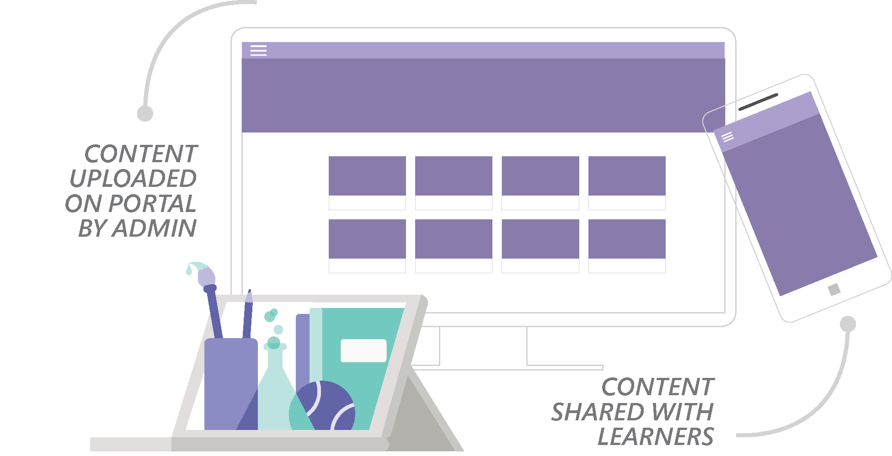

# Welcome to  Community Training

 Community Training is an Azure-powered online learning platform to enable organizations of all sizes and types to run large scale training programs for their internal and external communities such as first line workers, extended workforces, partner ecosystem, volunteer network, program beneficiaries, etc.

It is available as a Managed PaaS offering via Azure Marketplace that customers can easily deploy in their subscriptions. The platform is available for free and an organization only bears platform hosting and consumption charges on Azure.

## Benefits of  Community Training platform

### For the Organization

The platform supports personalized learning for a large-scale mobile-based community. It is affordable, easy to manage and provides robust security and privacy protection. Organization can leverage the  Community Training platform to:

1. Manage courses, users and analytics all in one place with the management portal

2. Empower managers, trainers and facilitators on the ground to easily reach out to a far-spread training audience and drive adoption of the learning program

3. Customize the look and feel of the platform and select learner endpoints for content consumption as per your organization needs

4. Track learning progress and measure outcomes using rich out of box reports or create custom dashboards to monitor health and measure overall program success

5. Leverage APIs to create your own training experience or integrate into your existing systems.

### For the Learners

The user experiences on the platform are optimized for mobile-first and mobile-only users and are kept simple and visual to ease adoption. Users can access courses anytime, anywhere from their choice of devices. Currently, organization can deliver training to the learners via following end points:

1. White-labelled responsive web app - optimized for mobile devices

2. White-labelled Android mobile app - for tablets and smartphones

3. Microsoft Teams

4. API integration into customer owned apps - available on request

## Management Portal

The management portal is a one-stop-shop for all administrative functions like upload and manage courses, add and organize users, assign courses and track completion, platform settings, etc. It is designed on the role-based access and functionalities are available to the users as per granted management permissions. For more details, please visit [**this article**](../get-started/user-role-and-management-portal-overview.md).

## Learner Experience

Made for learning on the go, user experience on the platform is optimized for learning with videos and quizzes – even on low bandwidth or while offline. While accessing the course content, learners can connect and interact with peers and experts in the communities to enable social learning.  

Lastly, learners can also use the platform to track activities and stay updated on the important updates sent by the administrators.

**Next>** Learn about different [**user personas and their roles and responsibilities**](../get-started/user-role-and-management-portal-overview.md).
