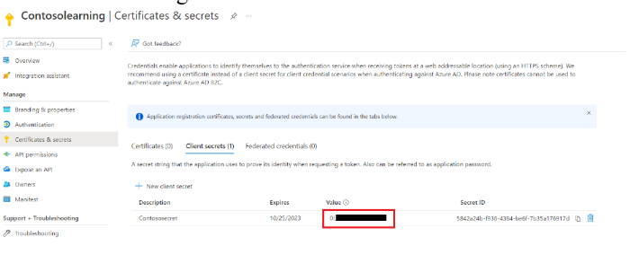

## Step-by-Step Guide: Microsoft Entra External ID App Registration for Community training 

### STEP 1: Sign in to Entra Admin Center 
* Navigate to: https://entra.microsoft.com 
* Sign in with an account that has at least Application Developer permissions. 
* If you have access to multiple tenants, click the Settings (gear) icon and switch to the target tenant. 

### STEP 2: Start New App Registration 
* Go to Entra ID > App registrations. 
* Click on + New registration. 

### STEP 3: Configure Application Details 

* Name: Enter a display name, e.g., identity-client-app or Fabrikam Learning. 
* Supported account types: Select Accounts in this organizational directory only (Single tenant). [For Social logins] 
* Redirect URI: 
   * Type: Web 
   * Value: `https://<portalname>-<uniquehash>.a/b/z02.azurefd.net/signin-b2c`

* • Click Register. 

### STEP 4: Note Down App Identifiers 

After registration, go to the Overview tab and copy: 

* Application (client) ID 
* Directory (tenant) ID

### STEP 5: Create an API Scope 
If the app will expose APIs: 
*  Navigate to Expose an API under Manage. 
*  Click + Add a scope. 
*  Enter an Application ID URI (e.g., api://<client-id>) and click Save and 
continue. 
* Fill in the following: 
   * Scope name: “access_as_user” 
   * Admin consent display name: access_as_user 
   * Admin consent description: access_as_user 
   * Leave user consent fields empty (or fill as needed). 
   * State: Enabled Scope name: “access_as_user” 
   * Admin consent display name: access_as_user 
   * Admin consent description: access_as_user 
   * Leave user consent fields empty (or fill as needed). 
   * State: Enabled 
* Click Add scope.

### STEP 6: Create a Client Secret 
* Navigate to Certificates & Secrets under Manage. 
* In the Client secrets section, click + New client secret. 
* Add a description (e.g., Contososecret) and choose an expiry (e.g., 6 or 12 
months). 
* Click Add. 
* IMPORTANT: Copy the Value immediately. This is your client_secret_for_B2C. It 
will not be shown again. Paste it on notepad for further use

### STEP 7: Create a sign-up and sign-in user flow 

* [Add a sign-up and sign-in flow](https://learn.microsoft.com/en-us/entra/external-id/customers/how-to-user-flow-sign-up-sign-in-customers). 

* [Add an application to the user flow](https://learn.microsoft.com/en-us/entra/external-id/customers/how-to-user-flow-add-application). 

* [Test User Flow](https://learn.microsoft.com/en-us/entra/external-id/customers/how-to-test-user-flows). 

* (optional) [Enable password reset](https://learn.microsoft.com/en-us/entra/external-id/customers/how-to-enable-password-reset-customers).

### STEP 8: Configure Identity Provider 

* [Identity Provider configuration for External tenant](https://learn.microsoft.com/en-us/entra/external-id/customers/concept-authentication-methods-customers).

### STEP 9: Steps to set the Configurations on the Platform 

* Login to [Azure portal](https://www.portal.azure.com/). 

* Go to App Services from the left-menu.

  

* Click on the app service belonging to your Community Training instance. 

* Select Environment variables under settings from the left-menu

  

Update the below mentioned app settings(if app settings are not available add them):

| Setting                     | Value / Description                                        |
|----------------------------|-------------------------------------------------------------|
| `AzureAdb2c__Instance`     | `https://<your-tenant-domain-name>.ciamlogin.com`          |
| `AzureAdb2c__Domain`       | `<your-tenant-domain-name>.onmicrosoft.com`                |
| `AzureAdb2c__ClientId`     | `<your-client-id>`                                         |
| `AzureAdb2c__TenantId`     | `<your-tenant-id>`                                         |
| `AzureAdb2c__ClientSecret` | Follow this Document                                       |
| `AzureAdb2c__Scope__0`     | `api://<your-client-id>/access_as_user`                   |

Once all app settings are updated it usually takes few minutes to reflect the changes, later check the login flow. 

