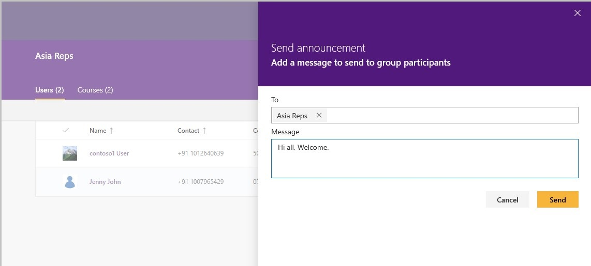

# Send announcement to the users

Microsoft Community Training platform allows administrators to send customize messages, alerts or broadcast information to different group of users via the announcement feature. Users can view these information and updates sent by the administrators  under the **Notice Board section** of the learner experience.

For example, if there are any courses that administrators would like to remind or encourage the learners to complete sooner,  then administrator can send a customized message (such as ‘You still have not completed the compliance training. Please complete soon to get certified’) as a follow up reminder to the group users and  push for course completion.

In this article, you will learn more about how an administrator can send an announcement to the group of users from the management portal:

## Permissions Level

The Microsoft Community Training management portal provides role-based administration and depending upon the type of access level administrator can perform an action on the portal. Table below shows administrative role which are allowed to send announcement to group users on the portal:

| Access Level  | Send Announcement |
| --- | --- |
| Global Administrator | Yes |
| Organization Administrator | Yes |
| Learning Path Administrator | No |
| Category Administrator | No |
| Course Administrator | No |
| Group Administrator | Yes |

## Steps to send announcements to the users

> [!TIP]
> Administrators can send the announcement either to the whole group or to a specific set of users in the group as required.

1. On the Microsoft Community Training portal, after login [**switch to administrator view**](../../get-started/step-by-step-configuration-guide.md#step-2--switch-to-administrator-view-of-the-portal).

2. Select a **User Group** under Users tab to whom you want to send announcement

3. You can use one of the following ways to choose the audience for sending the  announcements.
    - **Send announcement to all users in the group** - To send announcement to everyone in the group, just click on the **Send announcement** button in the group details page
    - **Send announcement to selected users in the group** – To send announcement to specific users in the group, select the list of users to whom you want to send the announcements and click on **Send announcement** as shown below.

    

4. Type the body of the message under **Message** section, which you want to send.

    

5. Click **Send** button to send the announcement.

> [!NOTE]
> Past announcements sent to the whole group or specific users in the group are displayed as part message panel.
