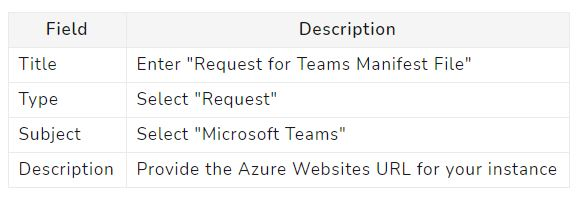

# General FAQs

### What is Microsoft Community Training?
Microsoft Community Training is an Azure-powered online learning platform to enable organizations of all sizes and types to run large scale training programs for their internal and external communities such as first line workers, extended workforces, partner ecosystem, volunteer network, program beneficiaries, etc.

It is available as a [**Managed PaaS offering via Azure Marketplace**](https://azuremarketplace.microsoft.com/en-us/marketplace/apps/project-sangam.microsoft-community-training?tab=Overview) that customers can easily deploy in their subscriptions. The platform is available for free and an organization only bears platform hosting and consumption charges on Azure. 

[**Click here**](../get-started/2_microsoft-community-training-overview.md) to learn more about the platform. 

### When was Microsoft Community Training launched? 
Microsoft community training was publicly announced on 22nd February 2017. It is currently in Public Preview and planning to become Generally Available by 2021. 

### Is Microsoft Community Training a Learning Management System?
Microsoft Community Training designed for mobile-first and mobile-only audiences. The platform is built and optimized  to work seamlessly on low bandwidth networks and low-end smartphones. 

While Microsoft community training is not a traditional Learning Management System (LMS), it does provide organizations to create a full ranged self-pace e-learning environment. Powered by Azure Microsoft community training enables you to share relevant information from a wide variety of sources. 

### What are the markets where Microsoft Community Training is available? 
Microsoft Community Training is available in all the countries or regions where Microsoft Azure Marketplace is commercially available. See the [**Azure Marketplace documentation**](/azure/marketplace/marketplace-geo-availability-currencies) for more details.  

### Who are the target audience for Microsoft Community Training? 
Microsoft Community Training is built and optimized for large scale community skilling program (i.e. volunteers, program beneficiaries, etc.) and extended enterprise training (i.e. first line workers, suppliers, distributors, retailers, etc.). The platform is designed for mobile first and mobile only audience and supports learning even on low-bandwidth networks and low-end smartphones.

The platform is already being used by number of large enterprises, small and medium businesses, startups, educational institutions, governmental organization and nonprofits.

### What kind of training scenarios I can use the Microsoft community training platform for?
Microsoft community training can be leveraged in a wide range of training use cases such as Employee Onboarding, Employee Upskilling, Mobile workforce training, Partner Training, Customer Training, Community Training, Online Learning Academy and many others.

These training use cases are cutting across multiple  verticals such as Banking & Financial Services, Retail, Healthcare, Manufacturing, Government Organizations & Nonprofit.

Microsoft Community Training platform provides organizations to not only share content with the target audience but also allow them to assess and track learner’s progress via quizzes, exams, and real-time analytics.

For more information [**visit our website**.](https://communitytraining.microsoft.com/). 

### Can I use Microsoft Community Training platform to train my employees and partners on Microsoft Product and Technologies?
Organization can use the Microsoft Community Training platform to host and train their workforces on multiple topics including Microsoft Product & Services. The platform comes with readily available content around Digital Literacy, Office 365, Azure, etc. 

Here is [**our free content library**](https://sangampartners.azurewebsites.net/) for your reference. Also, you can host content from [**Microsoft Learn**](/learn/) into the platform to provide one stop shop for all training courses to your target audience. 

For more details on how to leverage the import these content on your platform instance, reach out to us [**via Helpdesk**](https://go.microsoft.com/fwlink/?linkid=2104630).

### How to create / add a new course on Microsoft community training? 
Courses can be created from the administrator dashboard, for the detailed steps on course creation [refer to this article. ](../content-management/create-content/create-course-category/3_create-a-new-course.md)

### I already have an Learning Management System (LMS) implemented for my organization. Will Microsoft Community Training replace my existing LMS with or is it going to complement my existing system?
Traditionally LMS softwares are focused on knowledge workers and workforces managed by the organization. But every organization often has huge number of frontline workers (contractors, vendors, external staff, etc.) or extended partner network (distributors, suppliers, retailers, etc.) who are not managed by the organization i.e. there is no organization email address provided. These audiences are typically mobile-first users with low technology capability and usually require an online learning solution that is designed and optimized for shared low bandwidth mobile device usage. 

Microsoft Community Training platform supports personalized learning for a large-scale mobile-based workforces and communities. It is affordable, easy to manage and provides robust security and privacy protection. Organization can leverage the Microsoft Community Training platform to:
* Manage courses, users and analytics all in one place with the management portal
* Empower managers, trainers and facilitators on the ground to easily reach out to the far-spread training audience and drive adoption of the learning program
* Customize the look and feel of the platform and select leaner endpoints for content consumption as per your organization needs
* Track learning progress and measure outcomes using rich out of box reports or create custom dashboards to monitor health and measure overall program success
* Leverage APIs to create your own training experience or integrate into your existing systems.

So, depending upon use cases, organization can use Microsoft Community Training in either of the following manner: 

* **If an organization already has an LMS in place** – Organizations can use this platform for unmanaged audiences like first line workers, extended workforces, partner ecosystem, volunteer network, program beneficiaries, etc. who needs to access content via mobile number or personal email address.

* **If an organization has no LMS** - Organizations can use this platform for both internal as well as external audiences.

### How many organizations are already using Microsoft Community Training platform? 
Currently, Microsoft Community Training is being used by hundreds of customers across India, Africa, South East Asia, and Latin America for skilling their workforces or training communities at scale.  For e.g. Here are some press release on our partnership with existing customers: [African Development Bank](https://news.microsoft.com/en-xm/2019/12/10/african-development-bank-launches-digital-tool-to-help-african-youth-learn-to-code/), [Gauteng Provincial Govt - South Africa](https://customers.microsoft.com/en-us/story/thintimillion), [UNICEF](https://www.unicef.org/press-releases/unicef-and-microsoft-launch-global-learning-platform-help-address-covid-19-education) ,[ Ministry of Housing and Urban Affairs - Govt. of India](https://news.microsoft.com/en-in/microsoft-project-sangam-swacch-bharat-mission/). 

### Is there any licensing fee for Microsoft Community Training platform? 
Microsoft Community Training  platform doesn't charge any licensing fee, customers only need to pay for the cloud services billed (i.e. Azure consumption) when learners actually use the platform. The Azure consumption cost depends on various factors like # of users, volume of content hosted and content consumed every month on the platform. 

Refer to this [**pricing calculator**](https://communitytraining.microsoft.com/pricing/) for more details.

### Can I get access to demo environment or trial version of Microsoft Community Training?

We have a guided tour available for you to play around and get familiar with the platform capabilities. Please navigate to the [**interactive demo**](https://communitytraining.microsoft.com/demo/ ) on the [**product website**](https://communitytraining.microsoft.com/).

Alternatively, you can also deploy and setup a platform instance on your Azure subscription from the [**Azure Marketplace**](https://azuremarketplace.microsoft.com/en-us/marketplace/apps/project-sangam.microsoft-community-training?tab=Overview).  

If you want access to demo instance, please reach out to us [**via our helpdesk**](https://go.microsoft.com/fwlink/?linkid=2104630). 

### What type of content format is supported on the platform?
Microsoft community training supports a wide range of formats as listed below: 

* **Video formats**: MP4, 3GP, 3G2, 3GP2, AVI, MEPG, MPG, WMV, VOB, MKV, FLV, DV, TS, ASF, M4V, MOV
* **Audio formats**: MP3 & OGG
* **Other formats**: PDF, PPT, PPTX, DOCX, HTML, EPUB
* **Hyperlinks**: Paste link in the upload lesson dialogue box ((Example: Contents added via external platforms such as YouTube or MS Learn using their URL)

For more information, check the article on [**how to manage course content**](../content-management/2_content-management-overview.md) on Microsofot Community Training platform.  

### Does the Microsoft Community Training platform come with some out of the box content?

Microsoft Community Training offers wide range of out of box video content such as MS Learn, Office products, Computer basics & Security etc. All these contents are free of cost and  can obtain the video contents by [**contacting our helpdesk**](https://go.microsoft.com/fwlink/?linkid=2104630) post your platform deployment. 

You can check [**our sample content library**](http://sangampartners.azurewebsites.net/) for reference. We constantly keep updating our content library.  

Please note - all content hosted in the content library is free of charge and provided under Creative Common license. So, you can tweak and change the content as per your requirements.

### How to request for teams manifest file?

1. Create a support ticket on[ Microsoft Community Training Helpdesk](https://sangamhelpdesk.microsoftcrmportals.com/SignIn?ReturnUrl=%2Fsupport%2Fcreate-case%2F) for a Microsoft Teams app manifest for your training platform instance in the following format,

   

2. Our team will provide you the Teams app manifest within 2-3 business days.

### In what languages is the Microsoft Community Training platform available?
Microsoft Community Training currently supports 28 languages on the platform: Albanian, Arabic, Bengali, Chinese (Simplified), Chinese (Traditional, Dutch, English, Finnish, French, Hindi, Kinyarwanda, Kurdish, Lao, Lithuanian, Malay, Oriya, Portuguese, Serbian (Cyrillic), Somali, Spanish, Swedish, Swedish, Tajik, Telugu, Tetum, Thai, Ukranian, Vietnamese.

For more information, [**refer here**](../settings/7_customize-languages-for-the-learners-on-the-platform.md).

### How can i raise a new language request? 
You can raise a request ticket via our [Helpdesk](https://sangamhelpdesk.microsoftcrmportals.com/) to request another language for your platform instance. Please refer to [this article](../settings/8_request-a-new-language.md) for more details.

### Is there support for live classroom training in Microsoft Community Training?

Currently, Microsoft Community Training is optimized for self-pace learning where learners can enroll for courses on their own and access content from anywhere, anytime. We don't have inbuilt support for live classroom. 

However, we recommend customers to use third-party applications such as Microsoft teams, Zoom, etc. and embed the meeting link as lesson in the course.  Post session, to mark the course completion, you can give learners quizzes which they can attempt in order to validate their training progress and achieve certificate. 

Also, you can replace the live training URL with the actual recording of the training session on the platform for people to view and consume the content later.

For more details, please reach out to us [**via helpdesk**](https://go.microsoft.com/fwlink/?linkid=2104630). 

### Does Microsoft Community Training platform has any learner tracking capability?
Yes, Microsoft Community Training platform comes with exhaustive instrumentation and inbuilt analytics that offers you to track learners progress, perform assessment and measure learning outcome as per your needs.

Apart from the inbuilt reports, customers can create dashboard and custom reports using third-party visualization tools such as Power BI. 

For more information on analytics, check out [**this article**](../analytics/2_analytics-overview.md).

####  How to delete my training portal? 
When you no longer need your training portal, you can delete it by deleting the resource group from the Azure portal. [Refer to this article](../infrastructure-management/configure-your-platform-infrastructure/6_delete-your-training-instance.md) for more details.  

### What kind of support is provided by Microsoft to the customers during implementation?
There are two channels available to the customers to seek help during platform setup and configuration: 
1. [**Self-serve documentation website**](http://docs.microsoftcommunitytraining.com/) which helps customers provide how to guide and explain different capabilities of the platform in detail. 
2.  [**24*7 support desk**](https://go.microsoft.com/fwlink/?linkid=2104630) in case customers are not able to find answers to their queries via documentation site.

### Can we (Microsoft Partner) host this in our Azure subscription tenant and package it as training platform to existing Office 365 customers? Does the license allow us to do that?
Yes, Microsoft Partners can setup the platform in their own subscription or on customer subscription and provide value services like integration with existing system, creating custom dashboard, platform configuration and setup, etc. 

For e.g. Microsoft Partners can leverage the platform to drive Office 365 training for existing or new customers. For this, they can use the [**existing content**](http://sangampartners.azurewebsites.net/) available in the catalogue for free. 

For more information and support, please contact us via  **[Helpdesk](https://go.microsoft.com/fwlink/?linkid=2104630)** and leave your requirements in the ticket description. 

### How to invite learners to the training portal instance?
There are various ways to invite users and create awareness about the platforms.

* **Email** – Send mass emails to your targeted users with the platform link.
* **Social Media** – Share details of the platform on your social media pages such as Facebook and what’s app groups. 
* **Integrate with the existing portal** – You can integrate our platform with your existing application or portals. 

#### How can I provide feedback on the Microsoft Community Training platform and request for new features? 
Customers can contact us via [**Helpdesk**](https://go.microsoft.com/fwlink/?linkid=2104630) for any issues or new feature request. Whenever we receive any feedback, we actively work to address the issue or prioritize the feature ask on the product roadmap.

### Does platform provides gamification capabilities to incentive learners complete course content?
At present, we don't have  gamification features leadership and badges but organizations can use practice quizzes and completion to drive learner engagement and course completion.

Having said that, gamification features are something on our roadmap which should be available soon. 

### How to move MCT resources across Azure subscriptions?
At present, we do not recommend moving resource group across different Azure subscriptions. Doing so might impact the services and functionalities of your MCT training portal.