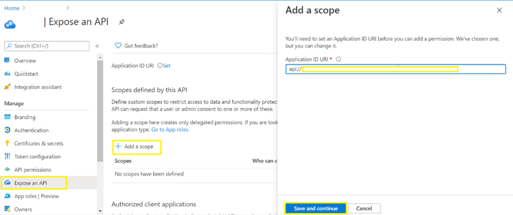
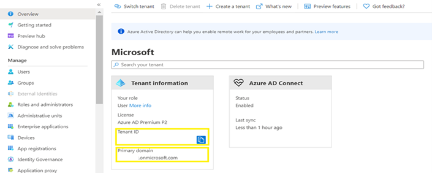
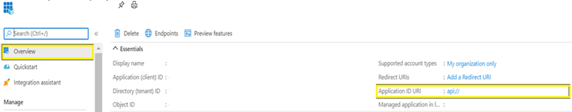

If you have been using Community Training (CT) APIs in public preview version and intend to continue using them with GA version, then following this documentation will help you accomplish that.
Community Training (CT) APIs support Service to Service (S2S) authentication to allow any external service to call the APIs without requiring a user to explicitly login to any CT instance. Please follow below steps to call CT APIs using S2S

# Step 1: Register Service Application
1.	Sign in to the Azure portal.

2.	If you have access to multiple tenants, use the Directory + subscription filter   in the top menu to select the tenant in which you want to register an application.

    [!NOTE] The Service Application to be registered must be created in the same Azure tenant as that of concerned CT instance.

3.	Search for and select Azure Active Directory.

4.	Under Manage, select App registrations > New registration.

5.	When the Register an application page appears, enter your application's registration information:

    a	In the Name section, enter a meaningful application name that will be displayed to users of the app (e.g. CT service).

    b	Leave Supported account types on the default setting of Accounts in this organizational directory only.

6.	Select Register to create the application.

7.	Select the Expose an API section, and:

    a	On Application ID URI, click on Set. Keep the suggested value, for example api://webapi-clientid  

    b	Click Save. 

    

8.	Select the Manifest section, and:

    a	Edit the manifest by locating the “appRoles”.  
    b	The role definition is provided in the JSON code snippet below.  
    c	Enter “allowedMemberTypes” to “Application”.  
    d	Enter your appRoles “displayName” (e.g. "S2SAppRole" used as displayName for the below code snippet)  
    c	Each role definition in this manifest must have a different valid Guid for the "id" property.  
    d	To create a unique Guid run the command “new-guid” from PowerShell.  
    e	Enter the role “value” as created in “Register Service application” step above. (e.g. "S2SAppRole")  
    f	Map the respective values properly and save the manifest.  
 >   [!Note]
>  The content of appRoles should be the following (the id should be unique GUID)  

{…  
   "appRoles": [  
      {  
           "allowedMemberTypes": [  
               "Application"  
           ],  
           "description": "Apps in this role can consume the web api.",  
           "displayName": "S2SAppRole",  
           "id": "Your guid created above",  
           "isEnabled": true,  
           "lang": null,  
           "origin": "Application",  
           "value": "S2SAppRole"  
       }  
   ],  
...}  

Save the following values to be used later:  

•	**Tenant ID** – Copy the TenantID from the ActiveDirectory overview page.  

•	**Tenant Name** – Similarly copy the TenantName from overview page. (e.g. {anyName}.onmicrosoft.com)  

The Overview page looks like:
 
 

•  **Application ID URI** – Copy the value from the overview page of registered application after completing “Expose an API” step as mentioned above (e.g. api://<webapi-clientid>)
The overview page of registered application looks like:

 
• **Value** – (e.g., S2SAppRole) Role that was created while editing the manifest in the above steps.

## Step 2: Register Client Application(s)

For each of the applications which would call the Community Training API’s, follow the steps under “**Approach 1**” OR “**Approach 2**” below based on the type of application which would call the APIs.  

**Approach 1:** For API calling service  hosted in Azure (List of the services)
Steps mentioned below are for Azure function, similar steps can be followed for other services.
1.	Follow the steps mentioned in this document to Create a new Azure Function App.

2.	Go the function app created above and click on the “Identity” section on the left.

    i.	Switch the status to “on”. Click on “Save”  

    ii.	Copy the value of “Object Id” shown on the screen thereafter. It will be required later.
 
    iii.	Follow the steps mentioned in this document to generate a token to call the APIs. A resource parameter is required to generate the token. For this parameter, provide the value of the Application ID URI as created in “Register Service application” step. (e.g. api://{Id})
>[!Note]
>Any coding language can be used based on the runtime stack selected while creating the Function App.

**Approach 2:** Creating a client by using [Client Credentials Flow](https://learn.microsoft.com/en-us/entra/identity-platform/v2-oauth2-client-creds-grant-flow)

Follow the steps mentioned below to Register the Client app.
1.	Sign in to the Azure portal.

2.	If you have access to multiple tenants, use the **Directory + subscription filter**   in the top menu to select the tenant in which you want to register an application.
3.	Search for and select **Azure Active Directory**.
4.	Under **Manage**, select **App registrations > New registration**.  

    •   In the **Name** section, enter a meaningful application name that will be displayed to users of the app, for example S2S-client.  

    •	In the **Supported account types** section, select **Accounts in this organizational directory only ({tenant name})**.  

    •	Select **Register** to create the application.  

5.	On the app **Overview** page, find the **Application (client) ID** value and record it for later.
6.	From the Certificates & secrets page, in the Client secrets section, choose **New client secret**:  
    •	Type a key description (of instance app secret),  

    •	Select a key duration of either In **1 year**, In **2 years**, or **Never Expires**.  

    •	When you press the **Add** button, the key value will be displayed, copy, and save the value in a safe location.  

    •	You'll need this key later to configure the project in Visual Studio. This key value will not be displayed again, nor retrievable by any other means, so record it as soon as it is visible from the Azure portal.  

7.	In the list of pages for the app, select **API permissions**.
    •	Click the **Add a permission** button and then,  

    •	Ensure that the **My APIs** tab is selected.  

    •	Select the API created in the previous step (e.g. MCT service created in the “Register Service application” step).  

    •	In the Application permissions section, ensure that the right permissions are checked (e.g. S2SAppRole created in “**Register Service application**” step)  

    •	Select the **Add permissions** button.  

8.	At this stage permissions are assigned correctly but the client app does not allow interaction. Therefore, no consent can be presented via a UI and accepted to use the service app. Click the **Grant/revoke admin consent for {tenant}** button, and then select **Yes** when you are asked if you want to grant consent for the requested permissions for all account in the tenant. 
> [!Note]
> You need to be an Azure AD tenant admin to do this.

>   [!Note]  
>    	Refer this [link](https://learn.microsoft.com/en-us/entra/identity-platform/v2-oauth2-client-creds-grant-flow) to generate tokens to call APIs.  

    POST /{tenant}/oauth2/v2.0/token HTTP/1.1     //Line breaks for clarity  

    Host: login.microsoftonline.com  

    Content-Type: application/x-www-form-urlencoded  

    client_id=<The application ID that's assigned to your app> 

    &scope=https://graph.microsoft.com/.default  

    &client_secret=sampleCredentials  

    &grant_type=client_credentials  

•	The value passed for the **scope** parameter in this request should be the resource identifier (application ID URI) of the resource you want, affixed with the .default suffix api://webapi-clientid/.default. For the Microsoft Graph example, the value is https://graph.microsoft.com/.default.

## Step 3: Contact CT support team to configure the Azure App Service

Contact CT support by raising a support request via the [helpdesk](https://aka.ms/cthelpdesk) and share following configuration details  

i.**ServiceAuthAudience**: Application ID URI created in “Register Service application” step **ServiceAuthTenantName**: Tenant name retrieved in “Register Service application” step.

ii.	**ServiceAuthTenantId**: Tenant Id retrieved in “Register Service application” step.

iii.**ServiceObjectIds**: This is required only if the Client type is of type **Approach 1** above. Enter the Object Id retrieved above. If multiple clients are created of this type, enter all of them here, separated by a semi-colon. (ObjectId_1;ObjectId_2…). **This is client objectId from step2-Approach1**.

iv.	**ServiceApplicationIds**: This is required only if the Client type is of type **Approach 2** above. Enter the Application Id retrieved above. If multiple clients are created of this type, enter all of them here, separated by a semi-colon. (ApplicationId_1;ApplicationId_2…). **This is client application ID from step2-Approach2.**

v.	**ServiceAuthRole**: This is required only if the Client type is of type 2. b) Enter the role value as created in the manifest in the **“Register Service application”** step above. (e.g. "S2SAppRole").    

> [!Note]
>While making Service auth calls, add a new header with key: **ClientType** and value: **Service**.
The client(s) created above should now be able to call the Community Training [Rest APIs](Rest-API-Documentation.md) through **Swagger**. Add the token(s) generated above to the Rest APIs exposed by the platform.

