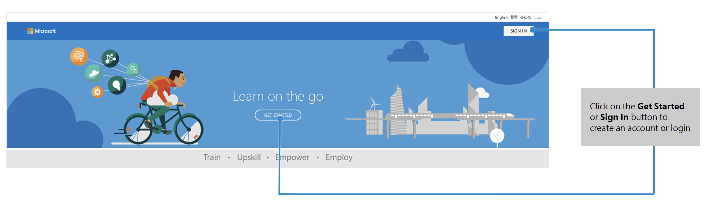
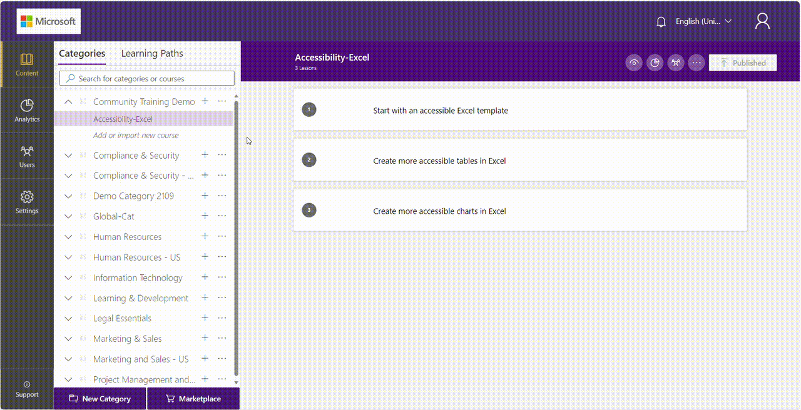

# Step-by-step configuration guide for platform setup

Community Training provides various tools and functionalities to help you easily create, manage, and monitor learning activities for training programs.

To make it simple for new users to get started with Community Training, you can use the following step-by-step implementation guide. It covers how to configure the learning platform, upload content, onboard users, select learner endpoints, track progress, and measure learning outcomes using the management portal.  

## Step 1 – Sign in to the portal

Select the **Get Started** or **Sign In** button to create an account or sign in. You can sign in with your mobile number, social account (email address), or Azure Active Directory account as defined at the time the platform is deployed from Azure marketplace.  

When signing in for the first time, you will be asked to complete your profile information.

> [!TIP]
> The profile information users need to provide at the time of sign-up can be customized from the management portal.

## Step 2 – Switch to administrator view of the portal

Once you sign in to the portal, by default, you will be shown the learner view. Select the **user icon** on the top right of the screen and select the **View as an administrator** option from the drop-down menu to open the management portal.  

The management portal provides all the administrative functions like course management, user management, tracking and monitoring through analytics, portal settings, and more. It is designed based on [**role-based access control**](../get-started/user-role-and-management-portal-overview.md). This means that features are only available to users based on whether they have been granted the right permissions.

> [!Tip]
> After logging into the management portal, it is recommended to [**add administrators**](../user-management/add-users/add-an-administrator-to-the-portal.md) and delegate portal management and configuration to other users in the organization.

## Step 3 - Customize the training portal

You can personalize the training portal by configuring various elements of the interface and user settings. To do so, use the **Settings** tab in the management portal:

* You can customize the [**look and feel of the portal**](../settings/customize-the-look-and-feel-of-your-portal.md)  to reflect your organization’s branding including the portal name, logos, color themes, banners, and messaging.

* You can also [**create additional profile fields**](../settings/add-additional-profile-fields-for-user-information.md) to capture user information at the time of sign-up.

* Lastly, you can [**restrict portal access**](../settings/restrict-portal-access-to-users-outside-your-organization.md) to  unauthorized users and protect your training content.

## Step 4 – Upload training content to the portal  

Community Training is optimized for learning with videos for mobile devices – even on low-bandwidth or while offline. It provides an easy way for your organization to create and manage online courses, and offer a seamless learning experience.

Courses in Community Training are created under categories. These categories can be based on topics, professions, skills, and more. Courses on the portal will have one or more lessons, non-graded assessments, graded assessments, and certifications.

To add learning material to your training portal, you need to [**define a category**](../content-management/create-content/create-course-category/create-a-category.md)  and [**create courses under that category**](../content-management/create-content/create-course-category/create-a-category.md). You can do this from the **Content Tab** in the management portal. When you create a new course, remember the following:

1. The course name should be simple and clear. Users should instantly understand the topic of the course when they read the title.

2. Write a description so your users will have a clear idea of what they will learn in each course.

3. Upload a customized image relating to the course topic to provide a visual cue to learners. Try to create different thumbnails for each course, to the avoid the redundancy of using the same image.

 Once you have created the courses, [**add learning materials**](../content-management/create-content/create-course-category/upload-content-to-a-course.md) like videos, PDF files, PowerPoint files, YouTube links, and more. Additionally, [**manage the course options**](../content-management/manage-content/manage-course-category/manage-users-for-a-course.md) according to your needs. Lastly, [**add assessments**](../content-management/create-content/create-course-category/add-assessments-to-a-course.md) before [**publishing the course**](../content-management/create-content/create-course-category/publishing-course.md) for your learners.

 

> [!TIP]
> Use [**bulk upload course**](../content-management/create-content/create-course-category/create-a-new-course.md#option-3---create-multiple-courses-in-a-category) to quickly upload your training content on the portal.

## Step 5 – Create a group and onboard learners to the portal  

Go to the **Users** tab in the management portal to start onboarding learners to the platform. To quickly add learners to the platform, create a CSV file containing the user’s data and [**bulk upload users**](../user-management/organize-users/add-multiple-users-to-the-group.md) to the portal. Bulk upload simplifies the process of adding many users at a time.

In case you have to onboard and manage a large user base, you should also [**create groups**](../user-management/organize-users/create-a-new-group.md) to organize your users based on their job profile, location, designation, and more. Additionally, [**add users**](../user-management/organize-users/create-a-new-group.md#manually-add-users-to-group-during-creation-time) manually into these groups. Once you have added users to a group, you can [**assign courses**](../user-management/manage-users/assign-content-to-group-users.md) to it.

Here are some best practices to follow to ease user management on the portal:

1. [**Assign administrators**](../user-management/add-users/add-an-administrator-to-the-portal.md) to delegate administrative tasks like user onboarding and course enrollment to the ground-level facilitator or supervisors. Facilitators/supervisors can track and monitor course activities of all the learners in their group and [**send reminders**](../user-management/manage-users/send-announcement-to-the-users.md) to drive completion.  

2. Leverage user profile information to [**create rules and automatically add users**](../user-management/organize-users/setup-automatic-user-enrollment-for-a-group-1.md) to different groups at the time of sign-up and assign courses.  

To learn more about how to manage users on the Community Training management portal, refer to the [**User Management**](../user-management/user-management-overview.md) section of the documentation.

## Step 6 – Launch and publish the portal  

Once you are done with customizing, uploading content, and adding users to the portal, you're on track to launch the portal for your target audience and start publishing content.  

Here are some checklists for you to complete before you proceed with the rollout:

1. [**Customize the certificate template**](../settings/customize-the-certificate-template.md) awarded to the learners on course completion.

2. [**Create and publish the mobile app**](../infrastructure-management/install-your-platform-instance/create-publish-mobile-app.md) for the learning portal on the Google Play Store.

3. If you want to deliver learning content inside Microsoft Teams, [**create a Teams app**](../infrastructure-management/install-your-platform-instance/create-teams-app-for-your-training-portal.md) and pin it as a Training tab in Microsoft Teams via the Office 365 admin portal.

4. Train the supervisors/facilitators (also called group administrators) on different aspects of the management portal and their roles and responsibilities.

5. Do a soft launch with a limited number of users to make sure the web app and mobile app are working as expected.

Once the platform is rolled out to the target audience, you can start publishing the portal for your learners by doing the following:

1. Create and display posters with a QR code in office areas or near lifts.  

2. Broadcast information via email or social media networks (such as WhatsApp messages) with a link to the app.

3. Create excitement and anticipation through contests, prizes, and performance-related incentives.

4. Share a letter from management on the day of the launch encouraging learners to begin to use the platform.

The points above are suggestions. You can use any alternative methods you deem fit for your audience.

## Step 7 – Track learner engagement and course completion  

Once the portal has been rolled out to the learners and they start accessing the course content, you can use the built-in analytics available in the management portal to track course enrollment, completion, and monitor learner activities on the portal.  

To view these analytics, go to the **Analytics** tab in the management view of the portal. There you will [**find reports**](../analytics/analytics-overview.md) that provide information on course enrollment across categories and courses, learner performance, content quality, and much more. You can also create custom reports to analyze specific information using Power BI.

These reports are important for tracking online learning and help administrators to continuously make improvements to the learning program.
