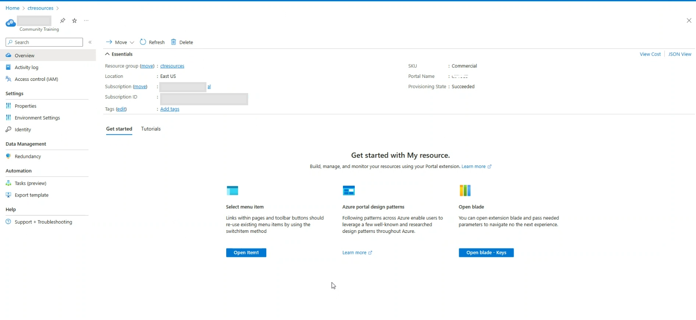

# Delete your training platform instance

When you no longer need your training portal, you can delete it by deleting the resource group from the Azure portal.

1. In the Azure portal, navigate to Resource groups in the left navigation pane.

   

1. Select the resource group belonging to your Community Training instance rom the list.

1. Click on the **Delete** option on the top.

   

> [!WARNING]    
> Once you delete your learning portal resource group, you will lose all data and it cannot be recovered.

Please reach out to us [**via HelpDesk**](https://aka.ms/cthelpdesk) if you have any further queries.