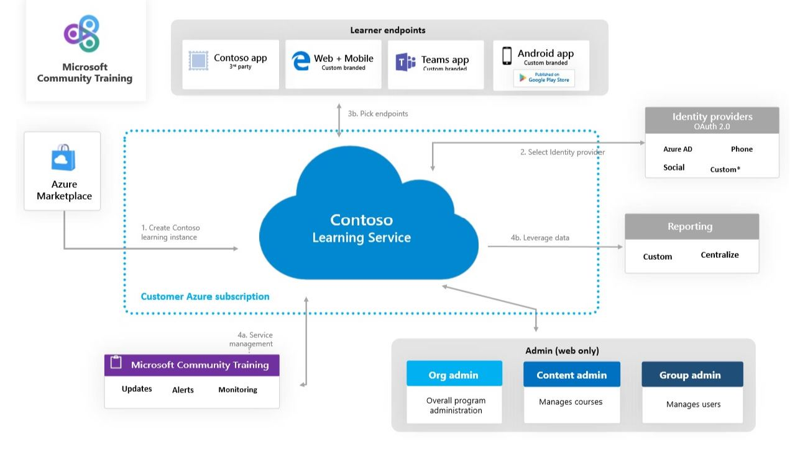

# Installation Overview

**Microsoft Community Training** platform is available as a [**Managed Application**](/azure/managed-applications/overview) on the [**Azure Marketplace**](https://azuremarketplace.microsoft.com/en-us). If you’re new to Azure, learn more about what it is from [**here**](https://azure.microsoft.com/overview/what-is-azure/).

Microsoft Community Training is available with multiple endpoints for the learners. For example - a standalone white-labelled web application, an Android mobile app, within Microsoft Teams or via API integration into your own custom app.

Learners can login in any of these endpoints in three different ways: Phone number, Social Account (Microsoft/Facebook/Google) and Work or School Account (Azure Active Directory).

## Platform Architecture

Once you install Microsoft Community Training in your subscription, you don't have to maintain, update, or service it. All updates to the application will be delivered automatically by Microsoft without the need for you to worry about troubleshooting and diagnosing issues.

The resources for Microsoft Community Training reside in two resource groups. You as a customer have access to one resource group called the Application resource group and the other resource group called the Managed resource group is managed by Microsoft.

You have full access to the **Application resource group**. You can use it to manage the lifecycle of your instance, which includes restarting it or deleting it.

**Managed resource group** holds all the resources that are required by Microsoft Community Training such as Azure App Service, Azure Storage, Azure Media Service. You have limited access to this resource group as Microsoft will manage all the individual resources for your instance on your behalf.

For more details, please refer to [**Azure managed applications**](/azure/managed-applications/overview) documentation.

## Steps to setup Microsoft Community Training platform

Once you have decided your preferred endpoint and login type, follow the steps below to setup and install Microsoft Community Training for your organization:

**Step 1:** [**Get an Azure subscription**](https://azure.microsoft.com/pricing/purchase-options/pay-as-you-go/) 

**Step 2:** [**Install from Azure Marketplace**](../../infrastructure-management/install-your-platform-instance/installation-guide-detailed-steps.md)

**Step 3:** [**Create the Mobile App and Publish**](../../infrastructure-management/install-your-platform-instance/create-publish-mobile-app.md)

**Step 4:** [**Get started on the portal**](../../get-started/step-by-step-configuration-guide.md)
