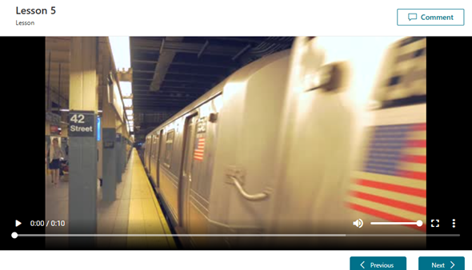
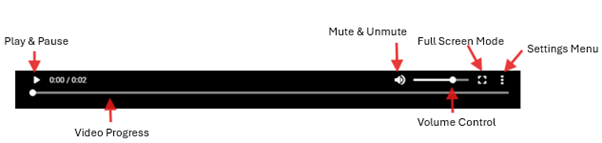
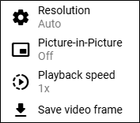
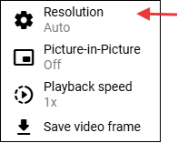
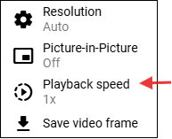
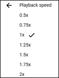

# The updated Media Player in Community Training
This article details the features and functionalities of the new player which is implemented as a replacement for the Azure Media Player service. 

#### Video Content Player

The new and enhanced video player on Community Training provides a cleaner view with minimalistic controls on the control section. The options available are:
1. Play/ Pause icon
2. Volume Control
3. Full Screen Toggle
4. Settings Menu

### Video Playback controls/options

## Settings Menu Options

The settings menu can be accessed by clicking on the three vertical dots to the bottom right of the player screen. 

### 1. Video Resolution

The learners can choose from available resolutions from this menu, for a seamless learning experience.   
  
> [!Note]  
> Community Training Supports resolution upto 1080p.

[Resolution Options](../media/AMS_Replacement/REsolution_Images.png)

### 2. Video Playback Speed 

 With this new player, Community Training now allows users to choose the playback speed to suite the users needs for an enhanced learning experience.

Please reach out to us [**via HelpDesk**](https://aka.ms/cthelpdesk) if you have any further queries.