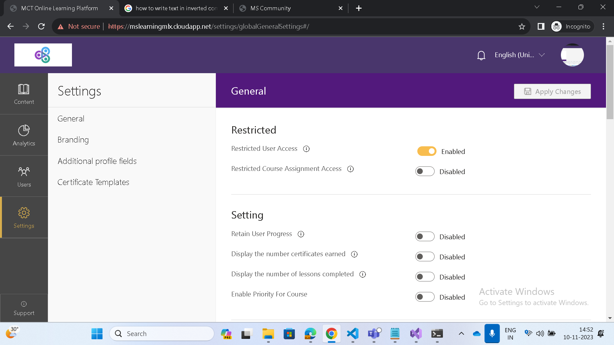

# Configurations on the training platform

You can customize the learner and administrator experience on the Community Training platform to fit the needs of your specific training program.

In this article, you will learn about the different configuration options available on the Community Training platform and how to enable or disable the configurations.

## Steps to Enable/Disable configurations on the platform

The support for Organizations can be enabled on the platform by:

1. Login to the administrator view on the platform as a **Global Adminsitrator**

2. Navigate to **Settings** on the left pane and click on **General** under **Global Settings**.

3. Toggle (Enable/Disable) the deisred configuration.

4. Click on **"Apply Changes"**.

5. Confirm the changes

4. Refresh the page



## Steps to set the configurations on the platform

1. Sign in to [Azure portal](https://www.portal.azure.com/).

1. Select **App Services** from the left-menu.

    

1. Select the application service belonging to your Community Training instance.

1. Select **Configuration** under *Settings* from the left-menu.

    

1. Go to **Applications Settings**.

    

1. Select the setting you want to edit, and update it with a relevant value.

    

    

1. Select **Save**.

    

## Configuration Options on the portal
| **Feature**                                                    | **Description**                                                                                                                                                                         |
|----------------------------------------------------------------|-----------------------------------------------------------------------------------------------------------------------------------------------------------------------------------------|
| Retain User Progress                                           | Enabling this flag will retain the user progress even after the user is removed from the course                                                                                         |
| Display the number certificates earned                         | Enabling this flag will show the learner the number of certificates that they have earned                                                                                               |
| Display the number of lessons completed                        | Enabling this flag will show the learner the number of courses they have completed today.                                                                                               |
| Display only mandatory courses                                 | Enabling this flag will show the users only the mandatory courses                                                                                                                       |
| Enable priority on a course                                    | Enabling this flag will allow the admins to set a priority on a course.                                                                                                                 |
| Enable Notifications                                           | Enabling this flag will enable the notifications to be shown to the learner                                                                                                             |
| Enable Comments                                                | Enabling this flag will allow the admins to enable the comments on the courses.                                                                                                         |
| Show Top Navigation Bar                                        | Enabling this flag will show the navigation bar on the top in the learner view.                                                                                                         |
| Enable Organizations                                           |  Enabling this flag will enable the organizations functionality.                                                                                                                        |
| Show courses in website landing page                           | Enabling this flag will show the courses in the landing page for the website. The learners can view the list of available courses even before logging in                                |
| Show Course Library                                            | Enabling this flag will allow the users to browse the course library and see the courses marked as "Self Enrolled" courses                                                              |
| Allow Courses to be Auto Enrolled                              | Enabling this flag will allow the admins to set courses to auto enroll to all users.                                                                                                    |
| Allow Seeking in Videos                                        | Enabling this flag will allow learners to seek through the videos.                                                                                                                      |
| Show Footer in Learner View                                    | Enabling this flag will show the footer in learner view.                                                                                                                                |
| Hide  Company Branding on Footer in Learner View               | Enabling this flag will hide the company branding in the footer.                                                                                                                        |
| Enable Custom Navigation Bar                                   | Enabling this flag will show a smaller top navigation bar                                                                                                                               |
| Show company Logo on Navigation Bar                            | Enabling this flag will show the company logo on the navigation bar                                                                                                                     |
| Enable Search for Courses                                      | Enabling this flag will enable search bar for the learners on the navigation bar.                                                                                                       |
| Enable Learner to Select Languages                             | Enabling this flag will allow learners to choose the language they wish to view the platform in. The course names will not change unless you upload the content in additional language. |
| Enable Notice Board for Admin Communications                   | Enabling this flag will enable the notice board (Email Icon) on the learner view.                                                                                                       |
| Enable Notifications in the Naviation Bar                      | Enabling this flag will enable notifications (Bell Icon) on the learner view                                                                                                            |
| Allow Users to access Profile in Nagivation Bar                | Enabling this flag will show "profile" option on the navigation bar.                                                                                                                    |
| Disable showing profile icon in Navigation Bar                 | Enabling this flag will show an icon to access profile on the navigation bar.                                                                                                           |
| Enable scheduling Teams Meetings. (Requires Teams Integration) | Enabling this flag will allow admins to schedule meetings from the portal directly.                                                                                                     |
| Disable profile edits by Org Admins                            | Enabling this flag will prevent the Org Admins from editing user profiles.                                                                                                              |
| Enable TWA (Mobile App)                                        | Enabling this flag will allow you to have a TWA App that can be created for the learners as a mobile app.Please reach out to our team to have the app created.                          |
| Allow PDF Lessons to be downloaded                             | Enabling this flag will allow the learners to download the PDF lessons.                                                                                                                 |
| Show Variable height PDF viewer                                | The height of the PDF viewer will adjust according to the document.                                                                                                                     |
| Allow Content to be accessible across organizations            | Enabling this flag will allow admins to add content such that it is accessible across organizations.                                                                                    |
| Set maximum file size for downloads                            | Set the maximum size in MB for the files that can be downloaded for offlien viewing. (1 MB = 1000000 bytes) (If file is less than 1 MB, enter value in decimals. Eg: 500 kb ~ 0.5 MB)   |
| Set the External website URL                                   | Enter the URL of the website to your company that you would like the learner to view. This shows up on the profile pane for the learner                                                 |
| Set the external website name                                  | Enter the display name for the external website that you would like the learner to view                                                                                                 |


<!--
## Certificates Received metric

```Certificates Received Metric
Features:CertificatesEarnedMetricsEnabled
```

The portal allows you to customize the **Certificate received** metric of the learner dashboard available in the learner's view. You can enable/disable the metric that shows the total certificates received by the learner.


By default, this metric is kept enabled with value as **True**.

## Courses Completed Today metric

```Courses Completed Today Metric
Features:CourseCompletionsTodayMetricsEnabled
```

The portal allows you to customize the **Course completed today** metric of the learner dashboard available in the learner's view. You can enable/disable the metric that shows the total number of courses the learner completed on that day (as per UTC time zone).


By default, this metric is kept disabled with value as **False**.

## Content Priority for Learners

```Content Priority for Learners
Features:EnablePriorityForCourse
```

The portal allows you to specify priorities to the courses while assigning them to the learners. You can enable/disable this feature on the portal depending on your specific requirements.

By default, this feature is enabled with value as **True** for administrator to assign priorities.

## Highest Priority Content for Learners

```Show only Required priority content to learners
Features:ShowOnlyRequiredCourses
```

The portal supports four levels of priorities to be assigned to courses: **Default**, **Optional**, **Recommended** and **Required**. You can configure the portal to show only those courses to learners which are assigned the "**Required**" priority.

By default, this feature is disabled with value as **False** and therefore all courses are visible to learners.

## Learner Notifications

```Learner Notifications
Features:NotificationDisabled
```

In the learner's view, the portal provides a [Notification icon](../learner-experience/web-app.md#step-8-view-notifications) which notifies the learner of any new courses being assigned to the learner. You have the flexibility to disable this features depending upon the scenario.

By default, this feature is **Disabled** with value as **False** so that learners get notifications in real-time.

## Learner Comments

```Learner Comments
Features:CommentDisabled
```

This enables discussions.
By default, this feature remains enabled but you have the flexibility to disable this function to avoid peer-to-peer interaction. Once disabled, learners will not be allowed to post comments.

## Learner Action Events

```Learner Action Events
Features:Events
```

The Community Training portal utilizes **Microsoft Azure Service Bus** to integrate with other supporting Azure services (like Azure Storage, Azure Media Service) for enhancing user experience. All events that trigger the service bus can be tracked and used for specific actions. You can enable this feature to get updates on specific triggers.

By default, this feature remains in **disabled** state.

## Enabling organizations on the platform

```Enable Organizations on the Platform
Features:IsMultiOrgDeployment
```

The Community Training portal allows you to [manage the portal with multiple organizations](../user-management/organization-management.md). An organization comprises of a group of learners and administrators on your training platform who have a particular purpose or belong to a specific criteria. You can enable/disable this feature depending upon your requirements.

By default, this feature remains disabled with value **False**, which blocks administrators from creating multiple organizations.

## Restricting the ability to edit the learner profile for non-global admin

```Disable profile edit for non-global admin
Features:disableProfileEditForNonSuperAdmin
```

Community Training allows you to restrict editing learner profiles to Global Administrators, set this value to **True** to activate this feature.

## Hide Navigation bar for learners

```Hide Navigation bar for Learners
Features:HideTopNavBarForLearner
```

You can embed the Community Training platform in another application with independent authentication and hide the top navigation bar on the learner's view. You can enable/disable this feature depending upon the specific requirements.

By default, this feature is disabled with value as **False**.


## Allow platform embedding

```Allow platform embedding
Features:SuppressXFrameOptionsHeader
```

You can embed the platform into iFrame or webview so that it can be integrated with other applications.

By default, this feature is disabled with the value **False** so that embedding is not supported, set to **True** if the platform is to be embedded into different application.

## Allow external video embedding into CT

```Allow external video embedding
AllowEmbedDomains
```

The portal can play external website content as an inline lesson from different domains.

By default, it remains empty. You can add domain names into the **Value** field to allow embedding (For Example: dailymotion.com).


## Hide landing page courses

```Hide landing page courses  
Features:HideCoursesInLandingPage
```

The landing page for learners shows the names and description of the self-enroll and auto-enroll courses before logging in on the platform. This can be avoided by setting the configuration to **True** to allow courses to be viewed only after log in.

By default, this feature is disabled with value as **False**, allowing learners to view the self-enroll and auto-enroll courses before they sign in to the training portal.


## Hide Course Library

```Hide Course Library  
Features:HideCourseLibrary
```

The portal allows you to hide the Course Library from the learner’s view of the platform. You can enable/ disable this feature on the portal depending on your specific requirements.

By default, this feature is kept disabled with value as **False** for permitting the learner to view the library.

## Disable creation of Auto-Enroll courses

```Features:AutoEnrollCourseEnabled
Features:AutoEnrollCourseEnabled
```

The Community Training portal allows you to disable marking a course as Auto-enroll whilst creating a [**new course**](/azure/industry/training-services/microsoft-community-training/content-management/create-content/create-course-category/create-a-new-course). By default, this feature is enabled and to disable this you need to set the value as **False**

:::image type="content" source="../media/featuredisableautoenrollcourse.png" alt-text="autoenrollcourse":::

## Enable PDF Download feature in lessons

The Community Training portal allows you to enable the Download feature for PDF lessons in the learner’s view of the platform.

```Enable
EnablePDFLessonDownload
```

By default this feature is not enabled, you need to add the above configuration and enable this feature by setting value to **True**. To disable this feature, set the value to **False**.

:::image type="content" source="../media/Enable PDF Download.png" alt-text="pdfdownload":::

## Allow learners to skip videos

```Allow learners to skip videos  
Features:EnableSeekingInVideos
```

The portal allows learners to skip through any video lesson while viewing it on the platform. This capability can be enabled/disabled on the portal depending on your specific requirements.

By default, this feature is kept disabled with value as **False**, ensuring that the learners DO NOT skip video lessons when they are completing the lesson for the first time. The learners can skip through in subsequent views even when this setting is set as False.

## Link External Website on Learner Homepage

The Community Training portal allows you to provide a link to an external website on the learner’s homepage to allow quick access to a preferred website.  Refer to [Steps to configure external website link and name](link-to-external-website-on-learner-Homepage.md#steps-to-configure-external-website-link-and-name) for further details .

## Steps to set Default Country for phone based login

If your instance has phone based authentication and you want to set a default country flag in the sign page, you will need to provide the [**Alpha-2 ISO code**](https://en.wikipedia.org/wiki/List_of_ISO_3166_country_codes) for the country you want as the value in the **DefaultCountry** application setting.

```Default Flag
DefaultCountry
```

In **Value** provide the two letter Alpha-2 country code, for example: to set default country as **India**, provide the value **IN**.

:::image type="content" source="../media/Default country.PNG" alt-text="Def_country":::

-->

## Configurations on Azure Portal

## Disable MS Teams integration with CT

```disable MS Teams integration  
deploymentType
```

When setting up the Community Training instance, if you opt for MS Teams integration by selecting "Yes" under **Enable Microsoft Teams?** and would now like to proceed without MS Teams integration, you can disable this deeper teams integration using this Application Configuration.

To disable this MS Teams integration, update this app setting with **Value = '0'**

> [!WARNING]  
>
>- MS Teams integration comes with CT instances with authentication type as "Work or School Account".
>- Once you disable the MS Teams integration, you would be able to add users to the platform via CT Admin UI.

:::image type="content" source="../media/Disable MS Teams integration.PNG" alt-text="Disable teams integration":::

## Enable PWA Mobile App

```Enable PWA Mobile App
Features:EnableWebAppInstall
```

The platform supports progressive web applications (PWA). To set up the mobile app for your training portal, enable this feature by setting the value to **True**.

By default, this feature is disabled with the value **False**.

## Manage course progress retention

```Enable retention of course progress
UserProgressRetentionEnabled
```

You can enable this application setting with the value **True** to retain a user's progress for the content even if the content is de-assigned from that user. That means, if a learner is removed from a course and then re-enrolled to the same course, previous progress would be retained.

By default, the application setting is marked as **False**. All the progress of that learner will be deleted from that course.

<!--

Note   FOR CONTENT WRITERS: MASKING IS NOT RELEASE UNTIL ATLEAST GA+1 RELEASE.

## Mask user details for admin

The Community Training platform supports masking of user data, this helps provide additional security by restricting admin from glancing sensitive user information.

You can enable masking of your user data by setting Features:Masking:IsProfileFieldsMaskEnabled to **True**.

```Enable Masking
Features:Masking:IsProfileFieldsMaskEnabled
```

Once the masking feature is enabled, you can choose which user information will be masked from the setting Features:Masking:MaskedProfileFields.

```Fields to be masked
Features:Masking:MaskedProfileFields
```

:::image type="content" source="../media/doc_3_1.png" alt-text="maskthefields":::

- Use `First Name` as a field in app settings to mask first name of the user or admin.
- Use `Contact` to mask EmailId/Phone number/Contact of the user or admin.
- Use `Last Name` to mask last name of the user or admin.
- To mask custom Profile Fields, use actual name of the field Eg: `State`, `SSN`.

-->

## Other flag configurations

| Flag Name | Description |
| --- | --- |
| `UserCacheExpiryInHour` | The user cache expiry time in hours. |

| `MaxRetryCountForWebJobs` | Number of retries for web job failure. This is for internal purposes and should not be tweaked by customers unless advised.|


Please reach out to us [**via HelpDesk**](https://aka.ms/cthelpdesk) if you have any further queries.