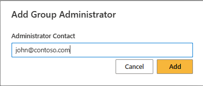

# Add administrators to the platform

The Community Training plaform provides six types of administrative roles on the portal: Global Administrator, Organization Administrator, Learning Path Administrator, Category Administrator, Course Administrator and Group Administrator. For more details, see the article on [**roles and responsibilities of different administrators**](../../get-started/user-role-and-management-portal-overview.md).

> [!NOTE]
> In case of Microsoft Teams integration, you won't be able to create Group administrator on the platform.  Group admin privileges are automatically assigned to owners of the Teams imported on the Community Training platform.

In this article, you will learn how to assign different administrative roles to a user.

## Permissions Level

The Community Training portal provides role-based permission levels. The table below shows which administrative roles can add different types of administrators.

| Access Level   | Add Global Administrator | Add Organization Administrator | Add Learning Path Administrator | Add Category Administrator | Add Course Administrator | Add Group Administrator  |
| --- | --- | --- | --- | --- | --- | --- |
| Global Administrator | Yes | Yes | Yes | Yes | Yes | Yes |
| Organization Administrator | No | Yes | Yes | Yes | Yes | Yes |
| Learning Path Administrator | No | No | Yes | No | No | No |
| Category Administrator | No | No | No | Yes | Yes | No |
| Course Administrator | No | No | No | No |  Yes | No |
| Group Administrator | No | No | No | No | No | Yes |

## Add a global administrator to the platform

In this topic, you will learn how to add a Global Administrator.

1. Log on to the Community Training portal and [**switch to administrator view**](../../get-started/step-by-step-configuration-guide.md#step-2--switch-to-administrator-view-of-the-portal).

1. Select **Global Administrators** from the **Users** tab on the top-left of the page.

    

1. Select **Global Administrator** on the details page to add new global administrator and enter the contact details of the user.

    

1. Select **Add** to add the user as an global administrator.

> [!IMPORTANT]
> If the portal is setup with the login identity of **Social Account** or **Azure Active Directory** you will need to enter email address in the above step.

## Add an organization administrator to the platform

Here are the detailed steps on how to [**add an organization administrator to the platform**](./../organization-management.md#create-a-new-organization-administrator).

## Add a learning path administrator to the platform

Here are the detailed steps on how to [**add a learning path administrator to the platform**](../../content-management/manage-content/manage-learning-path/add-an-administrator-for-a-learning-path.md).

## Add a category administrator to the platform

Here are the detailed steps on how to [**add category administrator to the platform**](../../content-management/manage-content/manage-course-category/add-an-administrator-for-a-course.md#add-a-category-administrator).

## Add a course administrator to the platform

Here are the detailed steps on how to [**add course administrator to the platform**](../../content-management/manage-content/manage-course-category/add-an-administrator-for-a-course.md#add-a-course-administrator).

## Add a group administrator to the platform

Groups are managed by group administrators, who can be users in the portal but are also able to manage users in the group, assign courses, and much more.

In this topic, you will learn how to add a Group Administrator.

1. Log on to the Community Training portal and [**switch to administrator view**](../../get-started/step-by-step-configuration-guide.md#step-2--switch-to-administrator-view-of-the-portal) then **select a Group**.

1. Select **More (...)** next to the group name.

    

1. Select **Add Administrator** from the drop-down menu then enter a valid phone number to add user.

    

> [!IMPORTANT]
> If the portal is setup with **Social Account or Azure Active Directory** as login identity then you will need to enter email address in the above step.

Alternatively, you can also **Add Administrator** to the group by clicking on **More(…)** on the top right of the details page and select **Manage Administrators** then select **Add Administrator** to add administrators to the Group.

## Adding one or more admins to an organization by Organization Admin

The Community Training platform now supports an organization administrator to add one or more other administrators, to their respective Organizations.

### Steps to add one or more Administrators to an organization, by an Organization Administrator

1. Log on to the Community Training portal and [**switch to administrator view**](../../get-started/step-by-step-configuration-guide.md#step-2--switch-to-administrator-view-of-the-portal).
1. In the Users Tab, go to Organization Administrators
     > [!NOTE]
    > An Organization Admin will only be able to see the list of administrators of the organizations to which the Organization Admin has admin access is enabled

1. Click on "Add Administrators”

    :::image type="content" source="../../media/Add_Org_Admin.png" alt-text="Add admin option to Org Administrator":::

    > [!NOTE]
    > "Manage Organizations" option is greyed-out for Organization admin and will only be accessible to Global Administrator
1. In the pop-up box, add the user detail to whom the organization admin access is to be given along with the different organizations that you would like to give access to.

   

1. Select the organization then **Create**.
    > [!IMPORTANT]
    > Organization administrators will only be able to edit but not delete other Organization admininistrators.
