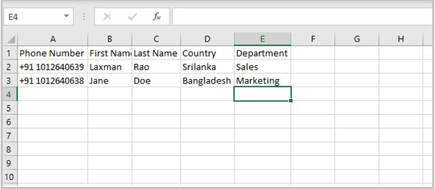

Group Administrators can use bulk upload users feature to save time and add multiple users to specific group in one go. 

In this topic, you  will learn how to bulk upload users to specific group on the management portal:  

### Permissions Level
The Microsoft Community Training management portal provides role-based administration and depending upon the type of access level administrator can perform an action on the portal. Table below shows administrative role which are allowed to add users to a group on the portal:

| Access Level    | Add multiple users to a Group |
| --- | --- | 
| Global Administrator | Yes |
| Organization Administrator  | Yes | 
| Learning Path Administrator | No |
| Category Administrator | No | 
| Course Administrator | No | 
| Group Administrator | Yes | 

## Prerequisite for using Bulk Upload users feature

Before you start doing the bulk upload of users for a specific group, you need to make sure the users list is structured in the right format on your local machine. The steps below provide information on how to create and verify that the users list is in the correct format: 

#### Step 1 - Download the sample CSV file

1.	Click or tap on the **Add user** icon and select **Bulk Upload Users** from the drop down.

2.	In the bulk upload users panel, select click to **download** the sample comma seperated values (CSV) file
{height="40" width=""}

#### Step 2 - Edit the sample CSV file to create users list

1.	Open the sample csv file in Microsoft Excel 

2.	Remove the sample users from the CSV file  

@(Error)(Warning)(Do not remove the column headers from the file)

3.	Start entering user details per row with the following information under each column header: 
    * Country Code - Type the country code of the user phone number **without the Plus (+)** sign. For e.g. 91
    * Phone Number – Type phone number of the user. For e.g. 9876XXXXXX 
    * First Name – Type First name of the user
    * Last Name – Type last name of the user 
{height="" width="600"}

@(Info)(Note)(In case portal is setup with **Social Account** or **Azure Active Directory** as login identity then you will need to enter email address in the above step.)

#### Step 3 – Add User Profile Data (optional)

1. Start adding additional column headers and values to the sample comma separated values (CSV) file. 

2. The column headers and values for these columns should match with the [**additional profile fields**](https://docs.microsoftcommunitytraining.com/docs/add-additional-profile-fields-for-user-information) created by the organization. For example: as shown in the image below:
    * Country and Department are added as two additional column headers to the CSV file. These column headers matches with the field names added in the additional profile fields. 
    * For country column you can see **Sri Lanka** and **Bangladesh** as row values whereas for department column you can see Sales and Marketing as row values. These values matches with the options specified for Country and Department fields in the additional profile fields section. 
    * In case additional profile field allows multiple selection (i.e. Multiple choice field) then use **Semicolon aka (;)** as a delimiter for adding multiple values via CSV file. For e.g. let's say there is additional profile field named *Topics of Interest* with allow learners to select multiple options such Organic Farming, Smart Farming, Increasing Yield, etc.  Now, at the time uploading CSV file, administrator can add multiple values for each user by adding text such as *Organic Farming;Smart Farming* ,  *Smart Farming;Increasing Yield*, etc. in each row against the Topics of Interest column. 
{height="170" width="500"}

3. Rename and save the file with new name, once you are done updating the user details 

@(Info)(Important)(Column headers and values are case-sensitive and should be exact match to the values available in the additional profile settings. Additional profile fields must be published for the csv file to be successfully uploaded. )

#### Step 4 – Verify the CSV file before uploading

1.	Open the users list csv file in Notepad - **Right Click > Open with > Notepad**. 

2.	Remove Word Wrap formatting from the tool bar - **Format > Word Wrap**.

3.	Verify the structure of the file is correct by ensuring the following things: 
    * For each user row, number of commas (,) is one less than number of columns i.e. Don't **use commas (,)** for values in the cell when updating sample csv file in Excel
    * For each user, there should not be any line break i.e. one user must be contained in a single row 
    * For each user, there is no blank values for the choices

4.	In case you find any issues with the file, edit and correct the structure as described in the previous steps. Given below is a screenshot of how a correct CSV file will look in Notepad 
{height="" width="400"}

## Steps to bulk upload users to specific group

1.	From the group details page, select **Bulk Upload Users** from **Add User** drop-down menu. 

2.	Alternatively, click or tap on the **More (...)** icon to the right of group name and select **Bulk upload users** options from the drop-down menu.

3.	Click or tap **Browse** and select the CSV file containing the users list from your local machine.
{height="" width="200"}

@(Info)(Note)(Before you begin this step, please ensure that user list is in correct format. See detailed steps on [**how to a create user list**](https://docs.microsoftcommunitytraining.com/docs/add-multiple-users-to-the-group#prerequisite-for-using-bulk-upload-users-feature).)

4.	Click or tap **Upload** to upload the CSV file.

@(Info)(Important)(There is a limit of 10000 users for each bulk upload operation. To upload more users, create multiple csv files.)

@(Warning)(Best Practices)(Bulk upload is a resource intensive operation and might take time until the process is completed. If it is taking too long to import users, please [**scale up your platform instance**](https://docs.microsoftcommunitytraining.com/docs/scale-up-instance-configuration).)
