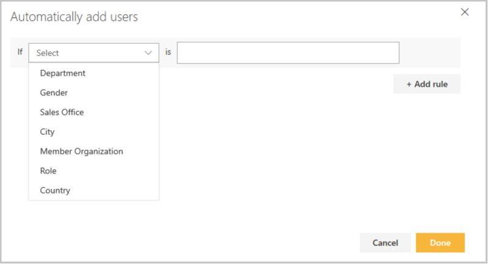
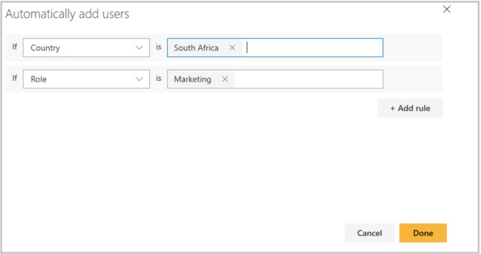
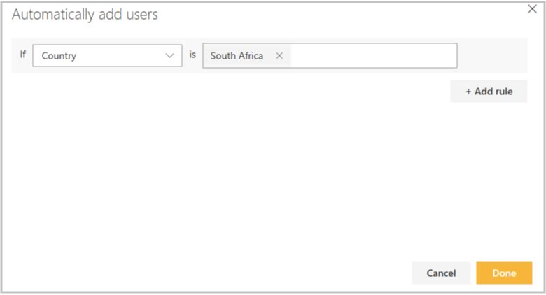
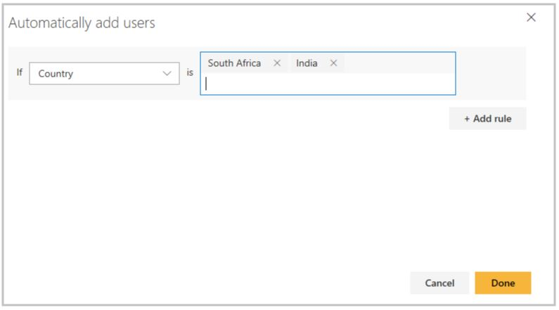
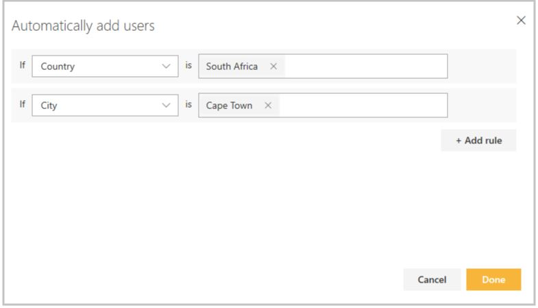
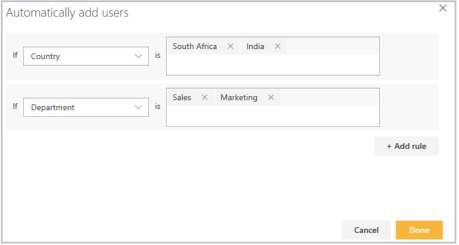

# Setup automatic user enrollment for a group

Group administrators can setup rules for a group to automatically add users to a specific group whenever the user's profile information matches the criteria of those rules.  

When a user registers on the portal and complete the profile information, the values entered are compared against the rule applied by administrators for each group and users are added to all the groups where their criteria matches.

> [!IMPORTANT]
> If **Organizations** are defined on the training platform, automatic enrollment will include the Group's organization as a criteria by default and group rules will act as the next level of criteria within the organization.

In this article, you will learn how to setup rules for a group to automatically add users.

## Steps to add rules for a group

### Case 1: No rules added to the group (Add smart group rules)

1. Select the Group from the **Users** tab to which you want to add a rule.

1. On the group details page, select **Add User** then **Add Rule** from the drop-down menu.

    

1. From the pop-up, select **If** custom field and choose the [**additional profile fields**](../../settings/add-additional-profile-fields-for-user-information.md) from the drop-down to create the rule.

    

1. Enter corresponding field value in **Is** field. The values entered must be a subset of the options specified for the additional profile field selected in the **If** field. For example, as shown in the example below:
    - **Country** and **Role** are selected as **If** field for which **South Africa** and **Marketing** are entered as values respectively.
    - This means all the existing and new users who has country as **South Africa** and role as **Marketing** will automatically get added to the group.

    

    > [!IMPORTANT]
    > Values given in the **IS** field are case sensitive and should exactly match the values in the additional profile fields.

1. Select **Done** to save the rule and users who match the criteria will be added to the group.

1. Groups which have rules applied will be prefixed with  sign.

### Case 2: Group already has rules applied (Edit smart group rules)

1. Select the group you want to add more rules to.

1. On the group details page, select **Rules applied** to open the Automatic Enrollments pane.
:::image type="content" source="../../media/Add rules to Smart Group1.png" alt-text="Rules applied"::: You will see a list of all the existing rules applied to the group.
:::image type="content" source="../../media/Add rules to Smart Group2.png" alt-text="Existing Rules":::

1. Select **Add** against the [**additional profile field**](../../settings/add-additional-profile-fields-for-user-information.md) where you would like to add value in the **Is** field.
:::image type="content" source="../../media/Add rules to Smart Group3.png" alt-text="Add new rule":::

1. In the **Automatically add users** pop-up, enter the values in the **Is** field as per your requirement then select **Done**.
:::image type="content" source="../../media/Add rules to Smart Group4a.png" alt-text="Select Value":::

1. Select **Done** in the **Automatic Enrollments** pane.
:::image type="content" source="../../media/Add rules to Smart Group5.png" alt-text="Save rules":::

> [!WARNING]
>
>- At a given moment, you can add multiple values to just one single profile field.
>
>- If you want to **add values to multiple profile fields**, enter value for one profile field by following step 4 to step 6. Then repeat the process from Step 2 to Step 6 as mentioned above to add values to another profile field.

## Sample rules for groups

Here are the some examples of different ways in which administrator can add rules for a group with one or more condition.

### Scenario 1: Only one IF condition and one value in the IS field

As shown in the image below, there is only one **IF** field - *‘Country’* - which is set to *'South Africa’*. A group with this rule would imply that any user who has entered their Country as South Africa will get added to the group.

### Scenario 2: Only one IF condition but multiple values in the IS field

As shown in the image below, there is only one **IF** field - *‘Country’* - which is set to *'South Africa'* or *'India’*. A group with this rule would imply that any user who has entered their Country as South Africa or India will get added to the group.

### Scenario 3: More than one IF condition but for each IF one value in the IS field

As shown in the image below,  there are two **IF fields - *‘Country’* and *‘City’* - which are set to *'South Africa’* and *'Cape Town’* respectively. A group with this rule would imply that any user who has entered their Country as South Africa *and* City as Cape Town will get added to the group.

### Scenario 4: More than one IF condition and for each IF multiple values in the IS field

As shown in the image below, there are two **IF** fields - *‘Country’*, set to *'South Africa’* or *'India’*, whereas *‘Department’* is set to *'Sales’* or *'Marketing’*. A group with this rule would imply that any user who has entered their Country as South Africa or India *and* their Department as Sales or Marketing will get added to the group.

> [!IMPORTANT]
> Values given in the **IS** field are case sensitive and should exactly match the values in the additional profile fields

## View existing rules applied

1. Select a group that has bolt sign, which indicates the group that has a rule applied for auto enrollment

1. Select **Rules applied** on the details page to view the existing rules.

> [!NOTE]
> **Rules cannot be edited or deleted**. To update an existing rule, a new group must be created and new rules set to the new group.
